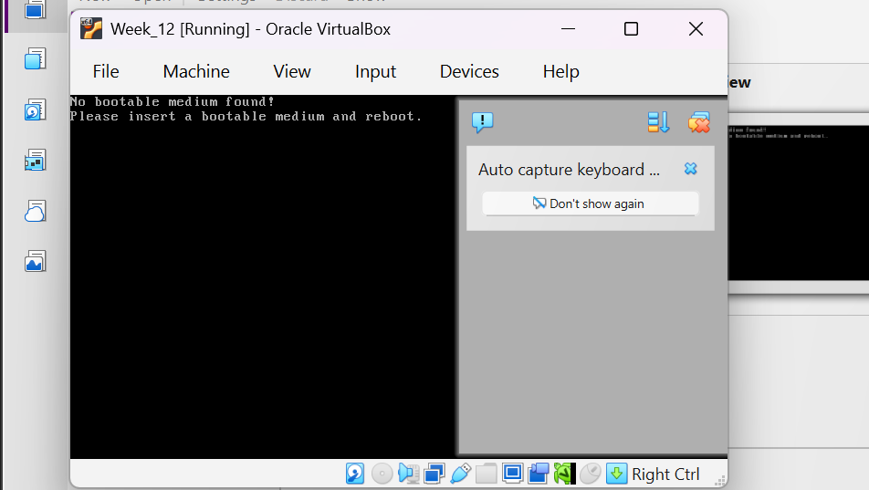

# Laporan Praktikum Minggu 12
Topik: Virtualisasi Menggunakan Virtual Machine  

---

## Identitas
- **Nama**  : SASKIA ISTIQOMAH
- **NIM**   : 250202967
- **Kelas** : 1 IKRA

---

## Tujuan
Setelah menyelesaikan tugas ini, mahasiswa mampu:
1. Menginstal perangkat lunak virtualisasi (VirtualBox/VMware).  
2. Membuat dan menjalankan sistem operasi guest di dalam VM.  
3. Mengatur konfigurasi resource VM (CPU, RAM, storage).  
4. Menjelaskan mekanisme proteksi OS melalui virtualisasi.  
5. Menyusun laporan praktikum instalasi dan konfigurasi VM secara sistematis.

---

## Dasar Teori

1. Virtualisasi Sistem Operasi :
Virtualisasi memungkinkan satu perangkat keras fisik menjalankan beberapa sistem operasi secara bersamaan melalui mesin virtual (Virtual Machine).

2. Host OS dan Guest OS :
Host OS adalah sistem operasi utama yang berjalan langsung pada perangkat keras, sedangkan guest OS berjalan di lingkungan virtual yang terisolasi.

3. Hypervisor :
Hypervisor merupakan perangkat lunak yang mengelola dan membagi resource perangkat keras kepada guest OS serta menjaga isolasi antar sistem.

4. Konfigurasi Resource Virtual :
Resource seperti CPU, RAM, dan storage dapat diatur sesuai kebutuhan, dan penggunaannya dibatasi oleh hypervisor.

5. Isolasi dan Keamanan Sistem :
Virtualisasi menyediakan isolasi antara host dan guest OS, sehingga meningkatkan keamanan dan stabilitas sistem.

---

## Langkah Praktikum
1. Langkah-langkah yang dilakukan.  
2. Perintah yang dijalankan.  
3. File dan kode yang dibuat.  
4. Commit message yang digunakan.

---

## Hasil Eksekusi

1. Instalasi VirtualBox

VirtualBox diinstal pada sistem operasi host dengan menjalankan installer hingga proses instalasi selesai. Setelah instalasi berhasil, aplikasi VirtualBox dapat dijalankan dengan normal.

2. Pembuatan Virtual Machine

VM baru dibuat dengan konfigurasi sebagai berikut:

Nama VM: Ubuntu-Week12

Tipe OS: Linux

Versi: Ubuntu (64-bit)

3. Konfigurasi Resource Awal

Resource awal yang diberikan pada VM:

RAM: 2 GB

CPU: 1 core

Storage: 20 GB (VDI, Dynamically Allocated)

4. Instalasi Sistem Operasi Guest

File ISO Ubuntu digunakan untuk menginstal sistem operasi guest. Proses instalasi dilakukan hingga selesai dan guest OS dapat melakukan login ke desktop Ubuntu.

5. Perubahan Konfigurasi Resource

Setelah VM berjalan, konfigurasi resource diubah menjadi:

RAM: 4 GB

CPU: 2 core

Perubahan ini dilakukan untuk mengamati perbedaan performa sistem sebelum dan sesudah penambahan resource. Pada konfigurasi awal, VM dijalankan dengan 1 core CPU dan 2 GB RAM, sehingga performa sistem terasa lebih lambat terutama saat menjalankan beberapa aplikasi secara bersamaan. Setelah konfigurasi diubah menjadi 2 core CPU dan 4 GB RAM, performa guest OS meningkat, ditandai dengan proses booting yang lebih cepat dan respons aplikasi yang lebih lancar. Perubahan ini menunjukkan bahwa alokasi resource yang diberikan oleh hypervisor sangat memengaruhi kinerja VM, serta membuktikan bahwa guest OS hanya dapat menggunakan resource sesuai batas yang ditentukan.

---

## Analisis
Analisis dan Pembahasan (Proteksi OS)

Virtual Machine menyediakan mekanisme proteksi sistem operasi melalui isolasi antara host OS dan guest OS. Guest OS berjalan dalam lingkungan terpisah dan tidak memiliki akses langsung ke file sistem, proses, maupun perangkat keras host.

Hypervisor berperan sebagai lapisan pengaman yang mengatur penggunaan resource seperti CPU, RAM, dan storage. Guest OS hanya dapat menggunakan resource yang telah dialokasikan, sehingga tidak dapat mengganggu kestabilan host OS.

Selain itu, VM berfungsi sebagai sandbox, yaitu lingkungan terisolasi yang aman untuk menjalankan sistem operasi atau aplikasi. Ketika guest OS mengalami error, crash, atau beban kerja tinggi, kondisi tersebut tidak memengaruhi host OS. Hal ini membuktikan bahwa virtualisasi meningkatkan keamanan dan stabilitas sistem secara keseluruhan.

## Kesimpulan

- Efisiensi Resource Berbanding Lurus dengan Responsivitas Sistem Berdasarkan hasil eksperimen, alokasi resource memiliki ambang batas minimum untuk kenyamanan penggunaan. Meskipun sistem dapat berjalan dengan 1 CPU dan RAM 2 GB, kondisi tersebut menyebabkan beban kerja CPU mencapai 100% dan sistem terasa kaku. Peningkatan ke RAM 4 GB dan 2 CPU terbukti paling optimal, mampu memangkas waktu tunggu pembukaan aplikasi dari 16 detik menjadi 5 detik saja.

- Keamanan Melalui Isolasi dan Sandboxing Penggunaan VM berhasil mendemonstrasikan konsep sandboxing, di mana Guest OS (Lubuntu) beroperasi dalam lingkungan yang sepenuhnya terisolasi dari Host (Windows). Segala beban kerja berat atau potensi kegagalan sistem di dalam Guest terbukti hanya berdampak di dalam lingkup virtualisasi tersebut tanpa mengganggu integritas dan stabilitas sistem operasi utama pada komputer fisik.

- Penerapan Hardening OS pada Host Pembatasan sumber daya (RAM dan CPU) yang dilakukan selama percobaan merupakan bentuk nyata dari hardening OS. Dengan mengunci alokasi resource bagi VM, Host secara otomatis terlindungi dari risiko pemborosan sumber daya (resource exhaustion). Hal ini memastikan bahwa sistem Host tetap memiliki cadangan performa yang cukup untuk menjalankan fungsi kritis lainnya meskipun Guest OS sedang bekerja pada kapasitas maksimal

---

## Quiz
1. Apa perbedaan antara host OS dan guest OS?
   **Jawaban:**

   Host OS dan Guest OS adalah dua jenis sistem operasi yang digunakan dalam konsep virtualisasi.
Host OS merupakan sistem operasi utama yang terinstal langsung pada perangkat keras komputer dan bertugas mengelola seluruh sumber daya fisik seperti prosesor, memori, penyimpanan, dan perangkat input/output. Host OS juga menjadi platform tempat aplikasi virtualisasi (hypervisor) dijalankan.
Sementara itu, Guest OS adalah sistem operasi yang berjalan di dalam mesin virtual yang dibuat oleh hypervisor di atas Host OS. Guest OS tidak berinteraksi langsung dengan perangkat keras, melainkan menggunakan sumber daya yang dialokasikan oleh Host OS. Dengan demikian, Host OS berperan sebagai pengelola utama sistem, sedangkan Guest OS berfungsi sebagai sistem operasi tambahan yang berjalan secara terisolasi untuk keperluan tertentu, seperti pengujian aplikasi, pembelajaran, atau menjalankan sistem operasi yang berbeda dalam satu komputer.

2. Apa peran hypervisor dalam virtualisasi?
   **Jawaban:**
   
Hypervisor memiliki peran sebagai lapisan kontrol utama dalam teknologi virtualisasi yang bertanggung jawab menciptakan, menjalankan, dan mengelola mesin virtual. Hypervisor bekerja dengan mengabstraksi perangkat keras fisik sehingga dapat digunakan oleh beberapa sistem operasi secara bersamaan. Ia menentukan pembagian sumber daya seperti waktu pemrosesan CPU, kapasitas memori, ruang penyimpanan, dan akses jaringan untuk setiap Guest OS. Selain itu, hypervisor menjaga keamanan dan stabilitas sistem dengan memisahkan satu mesin virtual dari mesin virtual lainnya, sehingga kegagalan atau kesalahan pada satu Guest OS tidak memengaruhi sistem yang lain. Dengan fungsi ini, hypervisor memungkinkan pemanfaatan hardware yang lebih optimal dan mendukung efisiensi operasional dalam lingkungan virtual dan komputasi awan.

   
3. Mengapa virtualisasi meningkatkan keamanan sistem?  
   **Jawaban:**

   Virtualisasi meningkatkan keamanan sistem karena setiap sistem operasi dan aplikasi dijalankan dalam lingkungan yang terisolasi satu sama lain melalui mesin virtual. Isolasi ini membuat serangan, malware, atau kesalahan pada satu Guest OS tidak langsung menyebar ke Guest OS lain maupun ke Host OS. Selain itu, virtualisasi memungkinkan penerapan kontrol akses dan pembatasan sumber daya yang ketat, sehingga dampak dari penyalahgunaan sistem dapat diminimalkan. Fitur seperti snapshot dan rollback juga meningkatkan keamanan karena sistem dapat dengan cepat dikembalikan ke kondisi aman sebelum terjadi gangguan. Dengan demikian, virtualisasi membantu menjaga stabilitas, mencegah eskalasi serangan, dan mempermudah pemulihan sistem ketika terjadi masalah keamanan.

---

## Refleksi Diri
Tuliskan secara singkat:
- Apa bagian yang paling menantang minggu ini?  
- Bagaimana cara Anda mengatasinya?  

---

**Credit:**  
_Template laporan praktikum Sistem Operasi (SO-202501) – Universitas Putra Bangsa_
