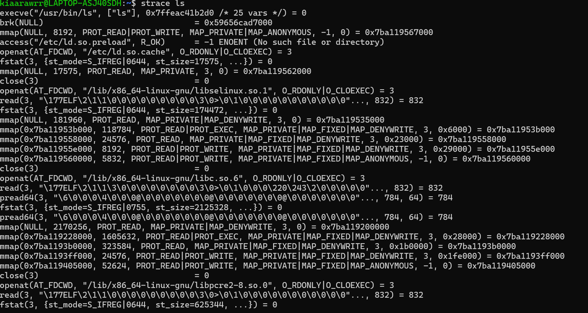
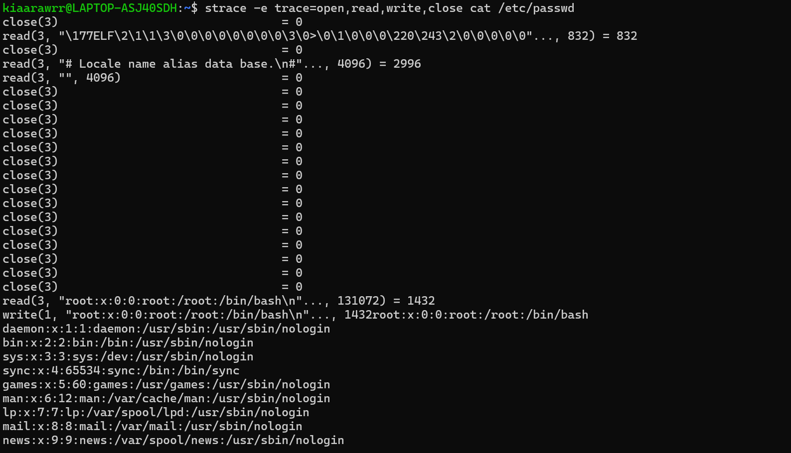
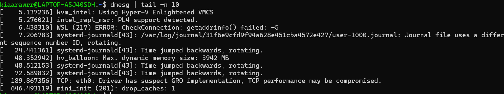
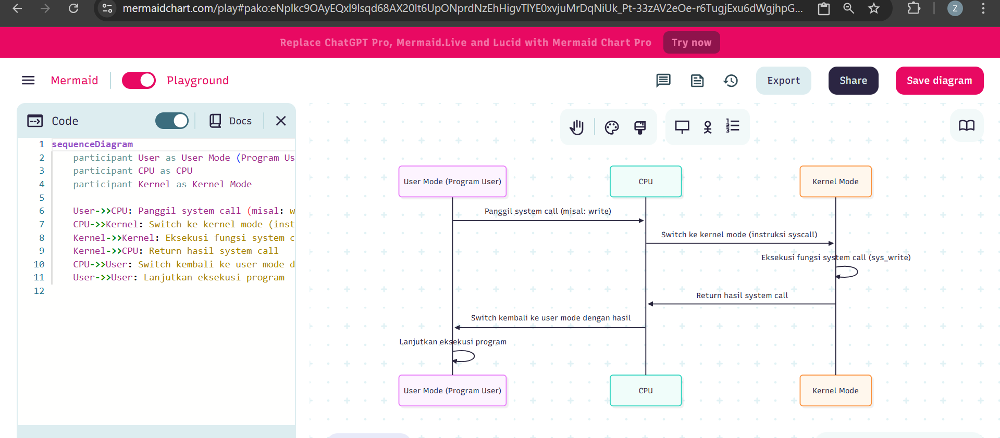

# Laporan Praktikum Minggu II
Topik: Struktur System Call dan Fungsi Kernel

---

## Identitas
- **Nama**  : SASKIA ISTIQOMAH
- **NIM**   : 250202967 
- **Kelas** : 1IKRA

---

## Tujuan
Setelah menyelesaikan tugas ini, mahasiswa mampu:

1. Menjelaskan konsep dan fungsi system call dalam sistem operasi.
2. Mengidentifikasi jenis-jenis system call dan fungsinya.
3. Mengamati alur perpindahan mode user ke kernel saat system call terjadi.
4. Menggunakan perintah Linux untuk menampilkan dan menganalisis system call.


## Dasar Teori
System call didasarkan pada konsep pemisahan user mode dan kernel mode. Sistem operasi melindungi sumber daya sistem dengan membatasi akses langsung dari aplikasi ke perangkat keras. Ketika sebuah aplikasi membutuhkan layanan sistem, ia melakukan system call, yang memicu trap (sejenis interupsi perangkat lunak) untuk beralih ke mode kernel, menjalankan fungsi yang diminta, lalu kembali ke user mode.


## Langkah Praktikum
1. Langkah-langkah yang dilakukan.  
2. Perintah yang dijalankan.  
3. File dan kode yang dibuat.  
4. Commit message yang digunakan.

---

## Kode / Perintah
Tuliskan potongan kode atau perintah utama:
```bash
uname -a
lsmod | head
dmesg | head
```

---

## Hasil Eksekusi
Sertakan screenshot hasil percobaan atau diagram:

 
 



---

## Analisis
Tugas
Tulis analisis 400–500 kata tentang:
-Mengapa system call penting untuk keamanan OS?
**jawaban** : System call adalah mekanisme yang memungkinkan program user berinteraksi dengan kernel sistem operasi (OS). Karena kernel memiliki akses penuh terhadap perangkat keras dan sumber daya sistem, system call berperan sebagai gerbang pengontrol antara aplikasi yang berjalan di user mode dengan operasi yang dijalankan di kernel mode. Oleh karena itu, system call sangat penting untuk keamanan OS karena mereka menetapkan batasan dan kontrol yang mencegah program user melakukan tindakan berbahaya secara langsung. Tanpa system call, aplikasi user dapat mengakses perangkat keras atau memodifikasi memori secara bebas, yang akan mengancam stabilitas dan keamanan sistem.

-Bagaimana OS memastikan transisi user–kernel berjalan aman?
**jawaban** : 
Sistem operasi memastikan transisi antara user mode dan kernel mode berjalan aman dengan memanfaatkan mekanisme hardware dan software yang ketat. CPU modern menggunakan privilege levels di mana user mode beroperasi pada level rendah dan kernel mode pada level tinggi, sehingga instruksi system call memicu perpindahan mode secara otomatis melalui interrupt atau trap gates yang hanya dapat diakses oleh kode yang sah. Saat transisi, OS menyimpan konteks proses user untuk menjaga integritas eksekusi, kemudian memvalidasi semua parameter system call agar tidak ada data berbahaya yang masuk ke kernel. Selain itu, manajemen memori yang ketat memisahkan ruang alamat kernel dan user, sehingga aplikasi user tidak dapat mengakses memori kernel secara langsung. Dengan pengelolaan hak akses yang tepat, OS juga memastikan bahwa hanya permintaan yang memiliki izin yang valid yang dijalankan di kernel. Kombinasi mekanisme ini menjaga keamanan dan stabilitas sistem selama perpindahan dari user mode ke kernel mode dan kembali lagi.

-Sebutkan contoh system call yang sering digunakan di Linux.
**jawaban** : read() , write() , open() , close() , fork() , execve() , exit() , waitpid() , mmap() ,ioctl()

---

## Kesimpulan

System call adalah mekanisme penting dalam sistem operasi yang memungkinkan program aplikasi berkomunikasi dengan kernel untuk mengakses sumber daya seperti file, memori, dan perangkat keras. Karena program tidak bisa mengakses perangkat keras secara langsung, system call menjadi jembatan yang aman dan terkontrol antara aplikasi dan sistem inti komputer.
Fungsi system call mencakup berbagai aktivitas penting seperti manajemen file, proses, memori, dan komunikasi antar proses. Tanpa system call, program tidak akan mampu melakukan operasi dasar seperti membaca data, menyimpan file, atau menjalankan proses baru.
Selain sebagai penghubung, system call juga berperan dalam menjaga keamanan dan kestabilan sistem dengan membatasi akses langsung ke kernel. Oleh karena itu, pemahaman tentang system call sangat penting dalam mempelajari sistem operasi dan pengembangan perangkat lunak tingkat rendah.


---

## Quiz
1. Apa fungsi utama System Call dalam sistem operasi?
   **Jawaban:**  Fungsi utama dari system call adalah untuk memfasilitasi berbagai operasi penting, seperti manajemen proses (membuat dan mengelola proses), manajemen file (membaca, menulis, dan menghapus file), manajemen memori (mengalokasikan atau membebaskan memori), serta komunikasi antar proses dan interaksi dengan perangkat input/output. Melalui system call, sistem operasi dapat memberikan layanan ini tanpa mengorbankan keamanan atau kestabilan sistem.
Selain itu, system call juga memungkinkan sistem operasi untuk mengontrol hak akses, menjaga agar setiap proses hanya bisa menggunakan sumber daya yang diizinkan. Dengan cara ini, system call tidak hanya menjadi alat komunikasi antara user dan kernel, tetapi juga menjadi alat pengaman dan pengatur dalam lingkungan komputasi modern.

2. Sebutkan 4 kategori System Call yang umum digunakan.
   **Jawaban:**
 **Manajemen Proses (Process Management)**
   * Mengelola pembuatan, eksekusi, sinkronisasi, dan terminasi proses.
   * Contoh: `fork()`, `exec()`, `wait()`, `exit()`
**Manajemen File (File Management)**
   * Mengatur operasi pada file dan direktori seperti membuka, membaca, menulis, dan menutup file.
   * Contoh: `open()`, `read()`, `write()`, `close()`
**Manajemen Memori (Memory Management)**
   * Mengalokasikan dan membebaskan memori untuk program yang berjalan.
   * Contoh: `mmap()`, `brk()`
 **Komunikasi Antar-Proses (Interprocess Communication/IPC)**
   * Memungkinkan proses untuk bertukar data dan berkomunikasi.
   * Contoh: `pipe()`, `shmget()`, `msgsnd()`

3. Mengapa System Call tidak bisa dipanggil langsung oleh user program?
   **Jawaban:**
   System call tidak bisa dipanggil langsung oleh program pengguna untuk melindungi sistem dari risiko keamanan, menjaga stabilitas, dan menyederhanakan interaksi. Desain ini adalah bagian dari prinsip "multitasking dan protected environment" dalam OS modern, seperti Windows, Linux, atau macOS. Jika mencoba memaksa panggilan langsung (misalnya, melalui assembly), OS akan menghentikan program Anda karena melanggar aturan privilage.

   ---

## Refleksi Diri
Tuliskan secara singkat:


---

**Credit:**  
_Template laporan praktikum Sistem Operasi (SO-202501) – Universitas Putra Bangsa_
