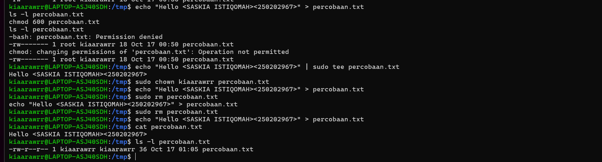

# Laporan Praktikum Minggu 3
Topik: Manajemen File dan Permission di Linux

---

## Identitas
- **Nama**  : SASKIA ISTIQOMAH
- **NIM**   : 250202967
- **Kelas** : 1IKRA

---

## Tujuan

Setelah menyelesaikan tugas ini, mahasiswa mampu:

1.Menggunakan perintah ls, pwd, cd, cat untuk navigasi file dan direktori.

2.Menggunakan chmod dan chown untuk manajemen hak akses file.

3.Menjelaskan hasil output dari perintah Linux dasar.

4.Menyusun laporan praktikum dengan struktur yang benar.

5.Mengunggah dokumentasi hasil ke Git Repository tepat waktu.

---

## Dasar Teori

Manajemen file dan permission di Linux merupakan bagian penting dari sistem operasi yang berfungsi untuk mengatur penyimpanan, pengelolaan, serta pengamanan data. Setiap file di Linux memiliki struktur izin (permission) dan identitas kepemilikan yang menentukan siapa saja yang dapat membaca, menulis, atau mengeksekusi file tersebut. Kernel berperan dalam mengatur akses file melalui sistem berkas yang terstruktur secara hierarki, dimulai dari direktori root (`/`). Dengan adanya pengaturan hak akses ini, Linux dapat menjaga keamanan sistem, mencegah penyalahgunaan data, dan memastikan setiap pengguna hanya dapat melakukan operasi sesuai dengan hak yang diberikan.

1. Manajemen file di Linux menggunakan sistem hierarki direktori dengan *root directory (`/`)* sebagai pusatnya.
2. Setiap file memiliki tiga jenis hak akses utama: *read (r)*, *write (w)*, dan *execute (x)* untuk *user*, *group*, dan *others*.
3. Pengaturan permission berperan penting dalam menjaga keamanan, keteraturan, dan integritas sistem operasi Linux.


---

## Langkah Pengerjaan
1. **Setup Environment**
   - Gunakan Linux (Ubuntu/WSL).
   - Pastikan folder kerja berada di dalam direktori repositori Git praktikum:
     ```
     praktikum/week3-linux-fs-permission/
     ```

2. **Eksperimen 1 – Navigasi Sistem File**
   Jalankan perintah berikut:
   ```bash
   pwd
   ls -l
   cd /tmp
   ls -a
   ```
   - Jelaskan hasil tiap perintah.
   - Catat direktori aktif, isi folder, dan file tersembunyi (jika ada).

3. **Eksperimen 2 – Membaca File**
   Jalankan perintah:
   ```bash
   cat /etc/passwd | head -n 5
   ```
   - Jelaskan isi file dan struktur barisnya (user, UID, GID, home, shell).

4. **Eksperimen 3 – Permission & Ownership**
   Buat file baru:
   ```bash
   echo "Hello <NAME><NIM>" > percobaan.txt
   ls -l percobaan.txt
   chmod 600 percobaan.txt
   ls -l percobaan.txt
   ```
   - Analisis perbedaan sebelum dan sesudah chmod.  
   - Ubah pemilik file (jika memiliki izin sudo):
   ```bash
   sudo chown root percobaan.txt
   ls -l percobaan.txt
   ```
   - Catat hasilnya.

5. **Eksperimen 4 – Dokumentasi**
   - Ambil screenshot hasil terminal dan simpan di:
     ```
     praktikum/week3-linux-fs-permission/screenshots/
     ```
   - Tambahkan analisis hasil pada `laporan.md`.

6. **Commit & Push**
   ```bash
   git add .
   git commit -m "Minggu 3 - Linux File System & Permission"
   git push origin main
   ```

---
## Kode / Perintah
Tuliskan potongan kode atau perintah utama:

pwd
ls -l
cd /tmp
ls -a

cat /etc/passwd | head -n 5

echo "Hello <NAME><NIM>" > percobaan.txt
ls -l percobaan.txt
chmod 600 percobaan.txt
ls -l percobaan.txt
sudo chown root percobaan.txt
ls -l percobaan.txt

---

## Hasil Eksekusi
Sertakan screenshot hasil percobaan atau diagram:




---

## Analisis
- Jelaskan makna hasil percobaan.  
- Hubungkan hasil dengan teori (fungsi kernel, system call, arsitektur OS).  
- Apa perbedaan hasil di lingkungan OS berbeda (Linux vs Windows)?  

---

## Kesimpulan

Dari praktikum manajemen file dan permission di Linux dapat disimpulkan bahwa sistem operasi Linux memiliki mekanisme yang terstruktur dalam mengelola file dan hak akses pengguna. Melalui perintah seperti `ls -l`, `chmod`, `chown`, dan `chgrp`, pengguna dapat mengatur izin serta kepemilikan file untuk menjaga keamanan dan keteraturan sistem. Pemahaman terhadap konsep *read*, *write*, dan *execute* pada level *user*, *group*, dan *others* sangat penting agar setiap file hanya dapat diakses oleh pihak yang berhak. Dengan demikian, manajemen file dan permission di Linux berperan besar dalam menjaga integritas data, keamanan sistem, serta efisiensi penggunaan sumber daya komputer.


---

## Quiz
1. Apa fungsi dari perintah `chmod`? 
   **Jawaban:**
   
 Perintah chmod (change mode) berfungsi untuk mengubah hak akses atau permission pada file dan direktori di sistem Linux. Dengan chmod, pengguna dapat menentukan siapa yang boleh membaca (read), menulis (write), atau mengeksekusi (execute) suatu file, baik untuk pemilik (user), grup (group), maupun pengguna lain (others).

3. Apa arti dari kode permission`rwxr-xr--`?
   **Jawaban:**
   
 Kode rwxr-xr-- menunjukkan hak akses file atau direktori:
- rwx → Pemilik (user) memiliki hak read, write, dan execute.
- r-x → Grup (group) memiliki hak read dan execute saja.
- r-- → Pengguna lain (others) hanya memiliki hak read saja.
Artinya, hanya pemilik file yang dapat mengedit atau menjalankan file, sementara grup hanya bisa menjalankan dan membaca, dan pengguna lain hanya dapat membaca tanpa mengubah isi.

3. Jelaskan perbedaan antara `chown` dan `chmod`.
   **Jawaban:**
   
Perintah chown digunakan untuk mengubah kepemilikan file atau direktori, baik pemilik (user) maupun grup-nya, sedangkan chmod digunakan untuk mengubah hak akses atau permission terhadap file atau direktori tersebut. Dengan kata lain, chown mengatur siapa yang memiliki file, sedangkan chmod mengatur apa yang boleh dilakukan terhadap file itu.
---

## Refleksi Diri
Tuliskan secara singkat:
- Apa bagian yang paling menantang minggu ini?  
- Bagaimana cara Anda mengatasinya?  

---

**Credit:**  
_Template laporan praktikum Sistem Operasi (SO-202501) – Universitas Putra Bangsa_
1. Dokumentasikan hasil seluruh perintah pada tabel observasi di `laporan.md`.  
2. Jelaskan fungsi tiap perintah dan arti kolom permission (`rwxr-xr--`).  
3. Analisis peran `chmod` dan `chown` dalam keamanan sistem Linux.  
4. Upload hasil dan laporan ke repositori Git sebelum deadline.


---


