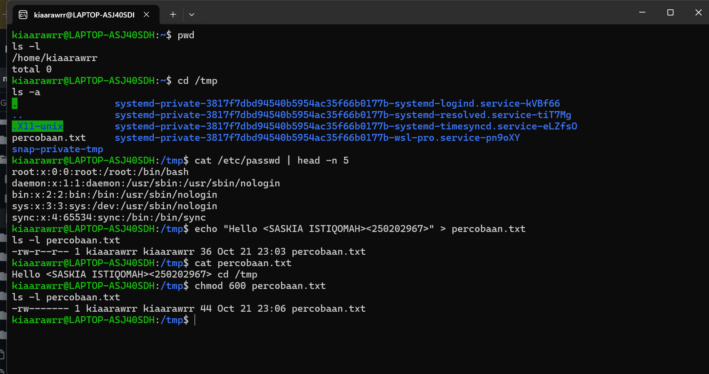

# Laporan Praktikum Minggu 3
Topik: Manajemen File dan Permission di Linux

---

## Identitas
- **Nama**  : SASKIA ISTIQOMAH
- **NIM**   : 250202967
- **Kelas** : 1IKRA

---

## Tujuan

Setelah menyelesaikan tugas ini, mahasiswa mampu:

1. Menggunakan perintah ls, pwd, cd, cat untuk navigasi file dan direktori.
2. Menggunakan chmod dan chown untuk manajemen hak akses file.
3. Menjelaskan hasil output dari perintah Linux dasar.
4. Menyusun laporan praktikum dengan struktur yang benar.
5. Mengunggah dokumentasi hasil ke Git Repository tepat waktu.

---

## Dasar Teori

Manajemen file dan permission di Linux merupakan bagian penting dari sistem operasi yang berfungsi untuk mengatur penyimpanan, pengelolaan, serta pengamanan data. Setiap file di Linux memiliki struktur izin (permission) dan identitas kepemilikan yang menentukan siapa saja yang dapat membaca, menulis, atau mengeksekusi file tersebut. Kernel berperan dalam mengatur akses file melalui sistem berkas yang terstruktur secara hierarki, dimulai dari direktori root (`/`). Dengan adanya pengaturan hak akses ini, Linux dapat menjaga keamanan sistem, mencegah penyalahgunaan data, dan memastikan setiap pengguna hanya dapat melakukan operasi sesuai dengan hak yang diberikan.

1. Manajemen file di Linux menggunakan sistem hierarki direktori dengan *root directory (`/`)* sebagai pusatnya.
2. Setiap file memiliki tiga jenis hak akses utama: *read (r)*, *write (w)*, dan *execute (x)* untuk *user*, *group*, dan *others*.
3. Pengaturan permission berperan penting dalam menjaga keamanan, keteraturan, dan integritas sistem operasi Linux.


---

## Langkah Pengerjaan
1. **Setup Environment**
   - Gunakan Linux (Ubuntu/WSL).
   - Pastikan folder kerja berada di dalam direktori repositori Git praktikum:
     ```
     praktikum/week3-linux-fs-permission/
     ```

2. **Eksperimen 1 – Navigasi Sistem File**
   Jalankan perintah berikut:
   ```bash
   pwd
   ls -l
   cd /tmp
   ls -a
   ```
   - Jelaskan hasil tiap perintah.
   - Catat direktori aktif, isi folder, dan file tersembunyi (jika ada).

3. **Eksperimen 2 – Membaca File**
   Jalankan perintah:
   ```bash
   cat /etc/passwd | head -n 5
   ```
   - Jelaskan isi file dan struktur barisnya (user, UID, GID, home, shell).

4. **Eksperimen 3 – Permission & Ownership**
   Buat file baru:
   ```bash
   echo "Hello <NAME><NIM>" > percobaan.txt
   ls -l percobaan.txt
   chmod 600 percobaan.txt
   ls -l percobaan.txt
   ```
   - Analisis perbedaan sebelum dan sesudah chmod.  
   - Ubah pemilik file (jika memiliki izin sudo):
   ```bash
   sudo chown root percobaan.txt
   ls -l percobaan.txt
   ```
   - Catat hasilnya.

5. **Eksperimen 4 – Dokumentasi**
   - Ambil screenshot hasil terminal dan simpan di:
     ```
     praktikum/week3-linux-fs-permission/screenshots/
     ```
   - Tambahkan analisis hasil pada `laporan.md`.

6. **Commit & Push**
   ```bash
   git add .
   git commit -m "Minggu 3 - Linux File System & Permission"
   git push origin main
   ```

---
## Kode / Perintah
Tuliskan potongan kode atau perintah utama:
```bash
pwd
ls -l
cd /tmp
ls -a
```
```bash
cat /etc/passwd | head -n 5
```
```bash
echo "Hello <NAME><NIM>" > percobaan.txt
ls -l percobaan.txt
chmod 600 percobaan.txt
ls -l percobaan.txt
```
```bash
sudo chown root percobaan.txt
ls -l percobaan.txt
```
---

## Hasil Eksekusi
Sertakan screenshot hasil percobaan atau diagram:


---

## Analisis

Baik! Berdasarkan **screenshot terminal Linux (WSL)** yang kamu lampirkan, berikut penjelasan lengkapnya untuk **hasil eksperimen 1, 2, dan 3**, isi file `/etc/passwd`, serta **analisis chmod**.

---

### ⚙️ **Eksperimen 1**

**Perintah yang dijalankan:**

```bash
pwd
ls -l
cd /tmp
ls -a
```

**Penjelasan:**

* `pwd` → Menampilkan *working directory* saat ini (`/home/kiaarwrr`).
* `ls -l` → Menampilkan daftar file dengan format *long listing*, termasuk permission, owner, grup, dan waktu modifikasi.
* `cd /tmp` → Pindah ke direktori `/tmp` (direktori sementara di Linux).
* `ls -a` → Menampilkan semua file termasuk yang tersembunyi (`.` dan `..`).

**Hasil:**
Kamu berada di `/tmp`, dan terlihat beberapa direktori sistem seperti:

```
.X11-unix
snap-private-tmp
systemd-private-...
```

Itu adalah direktori sementara milik berbagai *service systemd*.

---

### ⚙️ **Eksperimen 2**

**Perintah yang dijalankan:**

```bash
cat /etc/passwd | head -n 5
```

**Penjelasan:**

* `cat /etc/passwd` → Menampilkan isi file `/etc/passwd`, yaitu daftar seluruh user di sistem Linux.
* `| head -n 5` → Menampilkan hanya 5 baris pertama.

**Hasil (5 baris pertama):**

```
root:x:0:0:root:/root:/bin/bash
daemon:x:1:1:daemon:/usr/sbin/nologin
bin:x:2:2:bin:/usr/sbin/nologin
sys:x:3:3:sys:/dev:/usr/sbin/nologin
sync:x:4:65534:sync:/bin:/bin/sync
```

**Struktur /etc/passwd:**
Format setiap baris:

```
username:password:UID:GID:comment/home directory:shell
```

**Penjelasan tiap kolom:**

1. **username** → Nama user, misalnya `root`
2. **password** → Biasanya `x`, artinya password disimpan di `/etc/shadow`
3. **UID (User ID)** → Nomor identitas unik user (root = 0)
4. **GID (Group ID)** → Nomor grup utama user
5. **comment** → Deskripsi (biasanya kosong atau nama user)
6. **home directory** → Lokasi folder home user
7. **shell** → Shell default user (`/bin/bash`, `/usr/sbin/nologin`, dll)

---

### ⚙️ **Eksperimen 3**

**Perintah yang dijalankan:**

```bash
echo "Hello <NAME><NIM>" > percobaan.txt
ls -l percobaan.txt
chmod 600 percobaan.txt
ls -l percobaan.txt
sudo chown root percobaan.txt
ls -l percobaan.txt
```

**Penjelasan langkah demi langkah:**

1. `echo "Hello <NAME><NIM>" > percobaan.txt`
   → Membuat file bernama `percobaan.txt` berisi teks “Hello <NAME><NIM>”.

2. `ls -l percobaan.txt`
   → Menampilkan detail file, contoh awalnya:

   ```
   -rw-r--r-- 1 kiaarwrr kiaarwrr ...
   ```

   Artinya:

   * Owner = `kiaarwrr`
   * Group = `kiaarwrr`
   * Permission = `rw-r--r--` (owner boleh baca/tulis, group dan others hanya baca)

3. `chmod 600 percobaan.txt`
   → Mengubah permission menjadi:

   ```
   -rw------- 
   ```

   Hanya **pemilik** yang boleh membaca dan menulis, **tidak ada akses** untuk group dan others.

4. `sudo chown root percobaan.txt`
   → Mengubah pemilik file dari `kiaarwrr` menjadi `root`.

   Setelah perintah ini:

   ```
   -rw------- 1 root kiaarwrr ...
   ```

   Jadi **root** menjadi pemilik file, sedangkan group tetap `kiaarwrr`.

---

### 🔍 **Analisis Perbedaan Sebelum dan Sesudah chmod**

| Kondisi                 | Permission  | Makna                                           | Akses                                     |
| ----------------------- | ----------- | ----------------------------------------------- | ----------------------------------------- |
| **Sebelum** `chmod 600` | `rw-r--r--` | Owner bisa baca/tulis, group & others bisa baca | Dapat dibaca oleh semua user              |
| **Sesudah** `chmod 600` | `rw-------` | Hanya owner bisa baca/tulis                     | Lebih aman, hanya pemilik yang bisa akses |

---

###  **Kesimpulan**

* Eksperimen 1 mempelajari navigasi direktori dan melihat isi direktori sistem.
* Eksperimen 2 memperlihatkan struktur data user di sistem Linux melalui file `/etc/passwd`.
* Eksperimen 3 mempraktikkan pembuatan file, pengaturan izin akses (`chmod`), dan perubahan kepemilikan (`chown`).
* `chmod 600` memperkuat keamanan file dengan membatasi akses hanya untuk pemilik.

---

#Penjelasan Struktur Baris /etc/passwd
| Kolom          | Nilai               | Penjelasan                           |
| -------------- | ------------------- | ------------------------------------ |
| Username       | `daemon`            | Nama user                            |
| Password field | `x`                 | Kata sandi disimpan di `/etc/shadow` |
| UID            | `1`                 | User ID                              |
| GID            | `1`                 | Group ID                             |
| Deskripsi      | `daemon`            | Deskripsi (kadang nama lengkap)      |
| Home           | `/usr/sbin`         | Direktori "rumah" user               |
| Shell          | `/usr/sbin/nologin` | Shell default, tidak bisa login      |


#sebelum chmod
| Bagian         | Nilai        | Arti                                           |
| -------------- | ------------ | ---------------------------------------------- |
| `-rw-r--r--`   | Izin akses   | Pemilik: read+write, Grup: read, Lainnya: read |
| `kiaarawrr`    | Pemilik file | User yang membuat file                         |
| `36`           | Ukuran byte  | Ukuran file (36 karakter)                      |
| `Oct 21 23:03` | Waktu dibuat | Tanggal dan jam                                |


| Sebelum (`-rw-r--r--`) | Sesudah (`-rw-------`) |
| ---------------------- | ---------------------- |
| Owner bisa read+write  | Sama                   |
| Group bisa read        | ❌ Tidak bisa akses     |
| Other bisa read        | ❌ Tidak bisa akses     |


##ANALISIS PERBEDAAN SEBELUM & SESUDAH chmod
| Atribut       | Sebelum (`644`)           | Sesudah (`600`) | Dampak                       |
| ------------- | ------------------------- | --------------- | ---------------------------- |
| Akses Pemilik | `rw-`                     | `rw-`           | Tetap bisa baca & tulis      |
| Akses Grup    | `r--`                     | `---`           | Tidak bisa baca file lagi    |
| Akses Lainnya | `r--`                     | `---`           | Tidak bisa akses sama sekali |
| Privasi       | 🔓 Bisa diakses user lain | 🔒 Lebih aman   | Cocok untuk file sensitif    |


---

## Peran chmod dan chown dalam keamanan sistem linux

* **`chmod` (change mode)** digunakan untuk **mengatur hak akses** file atau direktori bagi **owner, group, dan others**. Dengan `chmod`, administrator atau pemilik file bisa menentukan siapa yang boleh membaca, menulis, atau mengeksekusi file, sehingga mencegah pengguna yang tidak berwenang melakukan perubahan atau menjalankan file sensitif.

* **`chown` (change owner)** digunakan untuk **mengubah kepemilikan file atau direktori**, baik pada **user** maupun **group**. Dengan pengaturan kepemilikan yang tepat, hanya user atau group tertentu yang memiliki kontrol penuh terhadap file, sehingga keamanan data lebih terjaga dan risiko akses ilegal dapat dikurangi.

kesimpulannya, **`chmod` dan `chown` bekerja sama** untuk memastikan bahwa hanya pengguna yang berhak yang dapat mengakses atau memodifikasi file, sehingga **menjaga keamanan dan integritas sistem Linux**.

---
## Kesimpulan

Dari praktikum manajemen file dan permission di Linux dapat disimpulkan bahwa sistem operasi Linux memiliki mekanisme yang terstruktur dalam mengelola file dan hak akses pengguna. Melalui perintah seperti `ls -l`, `chmod`, `chown`, dan `chgrp`, pengguna dapat mengatur izin serta kepemilikan file untuk menjaga keamanan dan keteraturan sistem. Pemahaman terhadap konsep *read*, *write*, dan *execute* pada level *user*, *group*, dan *others* sangat penting agar setiap file hanya dapat diakses oleh pihak yang berhak. Dengan demikian, manajemen file dan permission di Linux berperan besar dalam menjaga integritas data, keamanan sistem, serta efisiensi penggunaan sumber daya komputer.


---

## Quiz
1. Apa fungsi dari perintah `chmod`? 
   **Jawaban:**
   
 Perintah chmod (change mode) berfungsi untuk mengubah hak akses atau permission pada file dan direktori di sistem Linux. Dengan chmod, pengguna dapat menentukan siapa yang boleh membaca (read), menulis (write), atau mengeksekusi (execute) suatu file, baik untuk pemilik (user), grup (group), maupun pengguna lain (others).

2. Apa arti dari kode permission`rwxr-xr--`?
   **Jawaban:**
   
 Kode rwxr-xr-- menunjukkan hak akses file atau direktori:
- rwx → Pemilik (user) memiliki hak read, write, dan execute.
- r-x → Grup (group) memiliki hak read dan execute saja.
- r-- → Pengguna lain (others) hanya memiliki hak read saja.
Artinya, hanya pemilik file yang dapat mengedit atau menjalankan file, sementara grup hanya bisa menjalankan dan membaca, dan pengguna lain hanya dapat membaca tanpa mengubah isi.

3. Jelaskan perbedaan antara `chown` dan `chmod`.
   **Jawaban:**

Perintah chown digunakan untuk mengubah kepemilikan file atau direktori, baik pemilik (user) maupun grup-nya, sedangkan chmod digunakan untuk mengubah hak akses atau permission terhadap file atau direktori tersebut. Dengan kata lain, chown mengatur siapa yang memiliki file, sedangkan chmod mengatur apa yang boleh dilakukan terhadap file itu.

---

## Refleksi Diri
Tuliskan secara singkat:
- Apa bagian yang paling menantang minggu ini?
  Bagian yang paling menantang minggu ini dalam pembelajaran Linux file system permissions adalah memahami bagaimana sistem hak akses bekerja, terutama saat menggunakan perintah chmod dengan angka seperti 644, 600, atau 755. Angka-angka ini pada awalnya cukup membingungkan karena harus dikonversi dari kombinasi izin baca (read = 4), tulis (write = 2), dan eksekusi (execute = 1) untuk tiga jenis pengguna: pemilik, grup, dan pengguna lain. Tantangan lainnya adalah mengenali dampak perubahan izin tersebut terhadap keamanan dan aksesibilitas file.
- Bagaimana cara Anda mengatasinya?
  Untuk mengatasinya, saya mulai dengan membuat catatan tentang arti dari masing-masing angka dan mencoba menerapkannya secara langsung pada file yang saya buat sendiri. Saya menggunakan perintah chmod untuk mengubah izin, lalu mengeceknya kembali dengan ls -l agar bisa melihat perubahan secara langsung. Dengan praktik berulang dan mengamati hasilnya, saya menjadi lebih memahami bagaimana izin file bekerja dan bagaimana cara mengaturnya sesuai kebutuhan.
---

**Credit:**  
_Template laporan praktikum Sistem Operasi (SO-202501) – Universitas Putra Bangsa_
1. Dokumentasikan hasil seluruh perintah pada tabel observasi di `laporan.md`.  
2. Jelaskan fungsi tiap perintah dan arti kolom permission (`rwxr-xr--`).  
3. Analisis peran `chmod` dan `chown` dalam keamanan sistem Linux.  
4. Upload hasil dan laporan ke repositori Git sebelum deadline.


---


