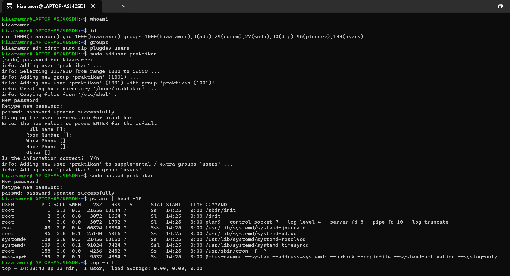
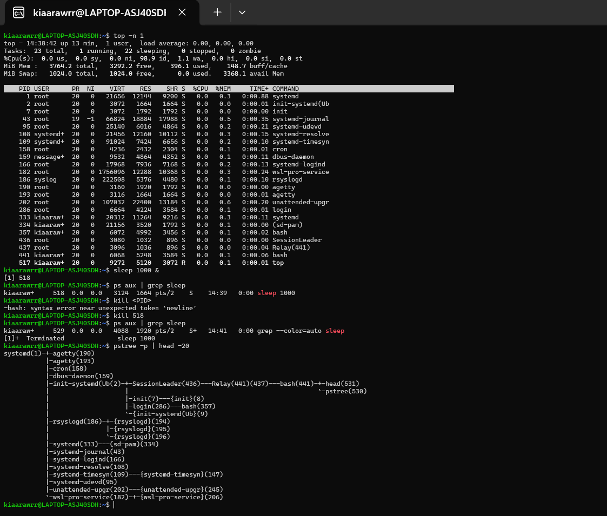

# Laporan Praktikum Minggu 4
Topik: Manajemen Proses dan User di Linux

---

## Identitas
- **Nama**  : SASKIA ISTIQOMAH
- **NIM**   : 250202967 
- **Kelas** : 1IKRA

---

## Tujuan
Setelah menyelesaikan tugas ini, mahasiswa mampu:

1. Menjelaskan konsep proses dan user dalam sistem operasi Linux.
2. Menampilkan daftar proses yang sedang berjalan dan statusnya.
3. Menggunakan perintah untuk membuat dan mengelola user.
4. Menghentikan atau mengontrol proses tertentu menggunakan PID.
5. Menjelaskan kaitan antara manajemen user dan keamanan sistem

---

## Dasar Teori

1. **Proses di Linux** adalah program yang sedang berjalan. Setiap proses punya nomor unik (PID) dan bisa membuat proses lain (anak proses). Semua proses ini diatur dalam bentuk pohon, dengan `init` atau `systemd` sebagai induknya.
2. **Pengelolaan proses** dilakukan dengan perintah seperti `ps` (melihat proses), `top` atau `htop` (memantau aktivitas sistem), dan `kill` (menghentikan proses). Linux juga memungkinkan pengaturan prioritas proses agar sistem tetap lancar.
3. **User dan group** digunakan untuk mengatur siapa yang bisa mengakses sistem. Setiap pengguna punya ID sendiri (UID), dan mereka bisa masuk ke dalam satu atau beberapa group (GID). Data tentang user tersimpan di file seperti `/etc/passwd`.
4. **Hak akses dan keamanan** diatur supaya pengguna hanya bisa melakukan hal yang diizinkan. Hak ini bisa diubah dengan `chmod`, `chown`, dan `chgrp`. Admin (root) punya kendali penuh untuk membuat atau menghapus user, menjaga sistem tetap aman dan tertata.

---

## Langkah Pengerjaan
1. **Setup Environment**
   - Gunakan Linux (Ubuntu/WSL).  
   - Pastikan Anda sudah login sebagai user non-root.  
   - Siapkan folder kerja:
     ```
     praktikum/week4-proses-user/
     ```

2. **Eksperimen 1 – Identitas User**
   Jalankan perintah berikut:
   ```bash
   whoami
   id
   groups
   ```
   - Jelaskan setiap output dan fungsinya.  
   - Buat user baru (jika memiliki izin sudo):
     ```bash
     sudo adduser praktikan
     sudo passwd praktikan
     ```
   - Uji login ke user baru.

3. **Eksperimen 2 – Monitoring Proses**
   Jalankan:
   ```bash
   ps aux | head -10
   top -n 1
   ```
   - Jelaskan kolom penting seperti PID, USER, %CPU, %MEM, COMMAND.  
   - Simpan tangkapan layar `top` ke:
     ```
     praktikum/week4-proses-user/screenshots/top.png
     ```

4. **Eksperimen 3 – Kontrol Proses**
   - Jalankan program latar belakang:
     ```bash
     sleep 1000 &
     ps aux | grep sleep
     ```
   - Catat PID proses `sleep`.  
   - Hentikan proses:
     ```bash
     kill <PID>
     ```
   - Pastikan proses telah berhenti dengan `ps aux | grep sleep`.

5. **Eksperimen 4 – Analisis Hierarki Proses**
   Jalankan:
   ```bash
   pstree -p | head -20
   ```
   - Amati hierarki proses dan identifikasi proses induk (`init`/`systemd`).  
   - Catat hasilnya dalam laporan.

6. **Commit & Push**
   ```bash
   git add .
   git commit -m "Minggu 4 - Manajemen Proses & User"
   git push origin main
   ```
---

## Kode / Perintah
Tuliskan potongan kode atau perintah utama:
```bash
whoami
id
groups
```
```bash
sudo adduser praktikan
sudo passwd praktikan
```
```bash
ps aux | head -10
top -n 1
```
```bash
sleep 1000 &
ps aux | grep sleep
```
```bash
kill <PID>
```
```bash
pstree -p | head -20
```

---

## Hasil Eksekusi
Sertakan screenshot hasil percobaan atau diagram:



---

## Analisis 

## **Eksperimen 1**
---

### 1. `whoami`

Output:

```
kiararwrr
```
Fungsi:
Menampilkan *nama user yang sedang aktif/login* ke sistem.
Hasilnya menunjukkan bahwa user aktif saat ini adalah `kiararwrr`.

---

### 2. `id`

Output :

```
uid=1000(kiararwrr) gid=1000(kiararwrr) groups=1000(kiararwrr),4(adm),24(cdrom),27(sudo),30(dip),46(plugdev),100(users)
```

Fungsi:
Menampilkan *identitas lengkap user*:

* `uid` → User ID (1000)
* `gid` → Group ID utama (1000)
* `groups` → Daftar grup yang diikuti user

Artinya, user `kiararwrr` adalah bagian dari grup `sudo`, sehingga bisa menjalankan perintah dengan hak administrator.

---

###  3. `groups`

Output:

```
kiararwrr adm cdrom sudo dip plugdev users
```

Fungsi:
Menampilkan *semua grup* yang diikuti oleh user `kiararwrr`.
Grup menentukan hak akses terhadap file dan perintah tertentu.

---

##  **Eksperimen 2**

---

###  `ps aux | head -10`

Fungsi:
Menampilkan *daftar proses yang sedang berjalan*, tapi hanya 10 baris pertama.

**Kolom penting:**

| Kolom     | Arti                                                    |
| --------- | ------------------------------------------------------- |
| `USER`    | Nama user pemilik proses                                |
| `PID`     | Process ID (nomor unik proses)                          |
| `%CPU`    | Persentase penggunaan CPU oleh proses                   |
| `%MEM`    | Persentase penggunaan memori                            |
| `VSZ`     | Ukuran virtual memory yang digunakan (dalam KB)         |
| `RSS`     | Memori fisik yang digunakan proses                      |
| `TTY`     | Terminal tempat proses berjalan                         |
| `STAT`    | Status proses (S = Sleep, R = Running, Z = Zombie, dsb) |
| `TIME`    | Total waktu CPU yang digunakan                          |
| `COMMAND` | Nama atau path program yang dijalankan                  |

Contoh:

```
root         1  0.0  0.3  21656 12164 ? Ss 14:25 0:00 /sbin/init
```

Artinya proses dengan `PID=1` dijalankan oleh `root`, statusnya `Ss`, dan merupakan proses **init/systemd** (proses induk dari semua proses lain di Linux).

---

###  `top -n 1`
Fungsi:
Menampilkan **ringkasan aktivitas sistem dan daftar proses secara real-time**, tapi hanya **sekali tampilan** (`-n 1`).

Bagian penting dari output:

* **Load average:** beban sistem (semakin kecil semakin ringan)
* **Tasks:** jumlah proses aktif, tidur, dan zombie
* **%Cpu(s):** penggunaan CPU total
* **MiB Mem/Swap:** penggunaan memori dan swap
* **Tabel bawah:** daftar proses (dengan kolom sama seperti `ps aux`)

---

##  **Eksperimen 3**

---

###  **Penjelasan:**

1. `sleep 1000 &`
   Menjalankan proses `sleep` selama 1000 detik **di background**.
   Simbol `&` artinya proses dijalankan di latar belakang.

2. `ps aux | grep sleep`
   Mencari proses yang mengandung kata “sleep” di daftar proses aktif.

Output:

```
kiararwrr   518  0.0  0.0 2144 1164 pts/2 S 14:39 0:00 sleep 1000
```

**PID proses sleep = 518**

3. `kill 518`
   Menghentikan proses `sleep` yang sedang berjalan menggunakan PID-nya.

---

---

## **Eksperimen 4**

---

###  Fungsi:

Menampilkan *struktur pohon (tree)* dari semua proses di sistem beserta PID-nya.

Contoh hasil (potongan):

```
systemd(1)─┬─agetty(193)
            ├─cron(158)
            ├─dbus-daemon(159)
            ├─init(systemd)(2)
            ├─login(286)───bash(357)
            └─...
```

---

###  Penjelasan:

* *`systemd(1)`* → proses dengan *PID 1*, merupakan *proses induk (parent process)* untuk semua proses lain di sistem.
* Setiap proses lain (seperti `cron`, `dbus-daemon`, `bash`, dll) adalah *anak (child process)* dari `systemd`.


---
- Dokumentasikan hasil semua perintah dan jelaskan fungsi tiap perintah.
- Gambarkan hierarki proses dalam bentuk diagram pohon (pstree) di laporan.
- Jelaskan hubungan antara user management dan keamanan sistem Linux.

---

## Kesimpulan
manajemen proses dan user di Linux merupakan bagian penting untuk menjaga stabilitas, keamanan, dan efisiensi sistem. Proses di Linux memiliki struktur hierarki, di mana setiap proses memiliki PID dan dapat memiliki proses anak, dan semuanya dikendalikan oleh proses induk utama seperti init atau system. User dan group digunakan untuk mengatur hak akses, sehingga hanya pengguna tertentu yang dapat melakukan operasi sensitif, sementara root memiliki hak istimewa untuk mengelola seluruh sistem. Melalui percobaan ini, pemahaman tentang perintah seperti ps, top, kill, killall, chmod, dan chown menjadi lebih jelas, sehingga teori tentang proses dan manajemen user dapat diterapkan secara praktis di sistem Linux.

---

## Quiz
1. Apa fungsi dari proses init atau systemd dalam sistem Linux?
   **Jawaban:**

   Proses **`init` atau `systemd`** adalah proses pertama yang dijalankan saat Linux dinyalakan dan berfungsi sebagai **induk dari semua proses lain** di sistem. Ia bertugas memulai berbagai layanan penting seperti jaringan, login, dan pengelolaan sistem, serta memastikan semua proses berjalan dan dihentikan dengan benar. Jika ada proses yang kehilangan induknya, `systemd` akan “mengadopsinya” agar sistem tetap stabil. Selain itu, `systemd` juga mengatur proses saat komputer dimatikan atau direstart, sehingga sistem bisa beroperasi dan berhenti dengan aman serta teratur.

2. Apa perbedaan antara kill dan killall? 
   **Jawaban:**
   
Perintah **`kill`** dan **`killall`** di Linux sama-sama digunakan untuk menghentikan proses, tetapi cara kerjanya berbeda. **`kill`** bekerja dengan menggunakan **PID (Process ID)**, yaitu nomor unik yang diberikan sistem untuk setiap proses yang sedang berjalan. Jadi, agar bisa menggunakan `kill`, kamu harus tahu nomor PID proses yang ingin dihentikan, misalnya dengan perintah `ps` atau `top`. Contohnya, `kill 1234` akan menghentikan proses dengan PID 1234 saja. Sementara itu, **`killall`** lebih praktis karena kamu hanya perlu menyebut **nama programnya**, bukan PID-nya. Misalnya, `killall firefox` akan menghentikan semua proses yang bernama *firefox* sekaligus. Dengan kata lain, `kill` cocok untuk menghentikan satu proses tertentu, sedangkan `killall` lebih efisien untuk menutup beberapa proses yang menjalankan program yang sama.

   
3. Mengapa user root memiliki hak istimewa di sistem Linux? 
   **Jawaban:**  

Karena root berperan sebagai administrator utama atau superuser, ia memiliki hak istimewa di sistem Linux untuk mengendalikan seluruh aspek sistem. Hak ini memungkinkan root melakukan tugas penting seperti menginstal atau menghapus program, mengubah konfigurasi sistem, mengelola user lain, serta mengatur izin dan kepemilikan file. Hak istimewa ini diperlukan agar sistem tetap aman, stabil, dan terkelola dengan baik, karena jika semua user biasa bisa melakukan operasi sensitif, risiko kesalahan atau penyalahgunaan akan sangat tinggi. Dengan demikian, root memiliki kontrol penuh untuk menjaga keamanan dan kelancaran sistem Linux secara menyeluruh.

---

## Refleksi Diri
Tuliskan secara singkat:
- Apa bagian yang paling menantang minggu ini?
  **jawaban** :
  Bagian yang paling menantang minggu ini adalah memahami bagaimana proses dan user saling berinteraksi di Linux, terutama konsep seperti hierarki proses (parent-child), PID/PPID, hak akses user, dan pengaturan izin file. Tantangan muncul karena ada banyak aturan yang saling terkait: misalnya proses yang dijalankan oleh user tertentu hanya bisa dikontrol oleh user itu sendiri atau root, dan memahami bagaimana hak akses memengaruhi kemampuan user terhadap proses dan file membutuhkan pemikiran logis yang detail.
  
- Bagaimana cara Anda mengatasinya?  
**jawaban** :
  Untuk mengatasinya, saya melakukan praktik langsung di terminal, seperti memantau proses dengan ps dan top, mencoba perintah kill, killall, nice, serta membuat user baru dan mengatur hak akses file dengan chmod dan chown. Praktik langsung membuat teori lebih mudah dipahami dan diingat.
---

**Credit:**  
_Template laporan praktikum Sistem Operasi (SO-202501) – Universitas Putra Bangsa_
