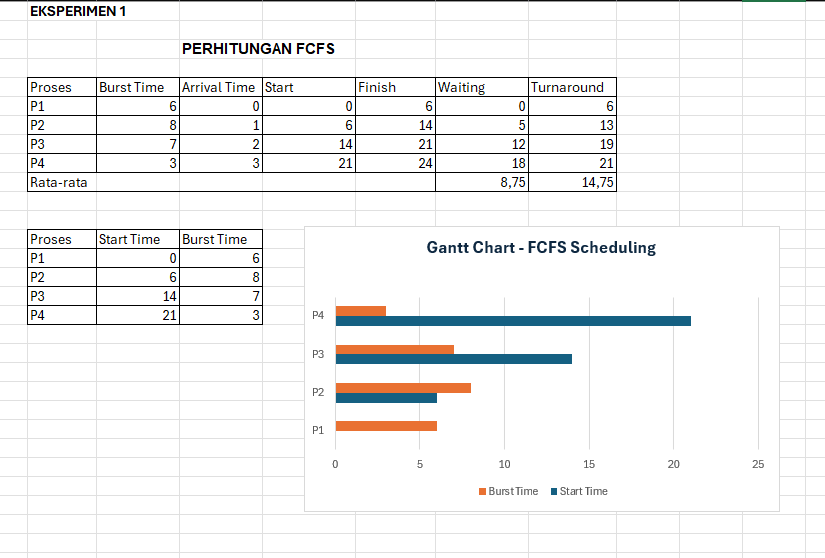
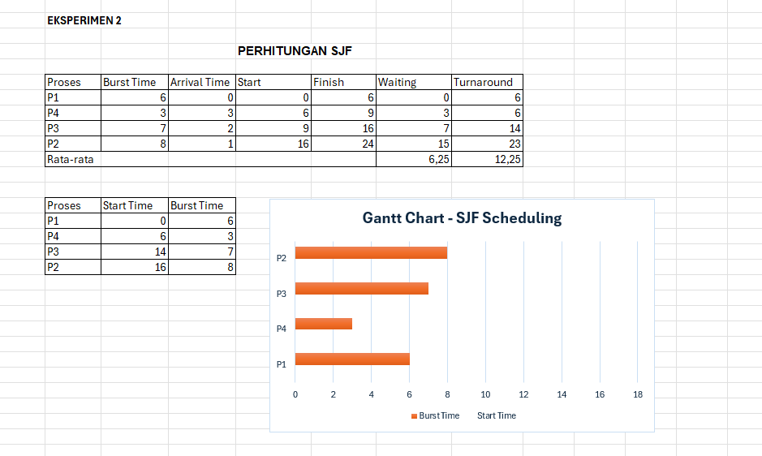
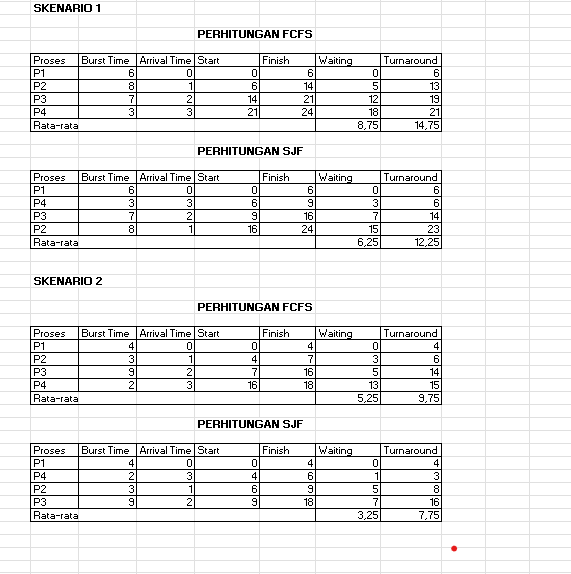

# Laporan Praktikum Minggu 5
Topik: Penjadwalan CPU – FCFS dan SJF

---

## Identitas
- **Nama**  : SASKIA ISTIQOMAH 
- **NIM**   : 250202967
- **Kelas** : 1IKRA

---

## Tujuan
Setelah menyelesaikan tugas ini, mahasiswa mampu:

1. Menghitung waiting time dan turnaround time untuk algoritma FCFS dan SJF.
2. Menyajikan hasil perhitungan dalam tabel yang rapi dan mudah dibaca.
3. Membandingkan performa FCFS dan SJF berdasarkan hasil analisis.
4. Menjelaskan kelebihan dan kekurangan masing-masing algoritma.
5. Menyimpulkan kapan algoritma FCFS atau SJF lebih sesuai digunakan.

---

## Dasar Teori

Penjadwalan CPU adalah proses yang dilakukan sistem operasi untuk menentukan urutan eksekusi proses yang menunggu giliran menggunakan prosesor. Tujuannya agar CPU dapat digunakan secara efisien dan setiap proses mendapat waktu eksekusi secara adil. Penjadwalan dapat bersifat *preemptive* (dapat digantikan) atau *non-preemptive* (tidak dapat digantikan hingga selesai).

*Pertama*, penjadwalan CPU bertujuan mengoptimalkan kinerja sistem melalui peningkatan *throughput*, pengurangan *waiting time*, serta pemanfaatan CPU yang maksimal.

*Kedua*, algoritma FCFS (First Come First Served) menjalankan proses berdasarkan urutan kedatangan. Algoritma ini mudah diterapkan namun dapat menyebabkan *convoy effect*, yaitu proses dengan waktu lama membuat proses lain menunggu.

*Ketiga*, algoritma SJF (Shortest Job First) memilih proses dengan waktu eksekusi (*burst time*) paling singkat. Metode ini dapat menurunkan waktu tunggu rata-rata, tetapi sulit diterapkan karena waktu eksekusi proses sering tidak diketahui.

*Keempat*, perbandingan keduanya menunjukkan bahwa FCFS unggul dalam kesederhanaan dan keadilan urutan, sedangkan SJF lebih efisien jika informasi durasi proses tersedia.

*Kelima*, kriteria evaluasi penjadwalan meliputi *CPU utilization*, *throughput*, *waiting time*, *turnaround time*, dan *response time* untuk menilai seberapa baik algoritma bekerja dalam mengelola proses.

---

## Langkah Praktikum

1. **Siapkan Data Proses**
   Gunakan tabel proses berikut sebagai contoh (boleh dimodifikasi dengan data baru):
   | Proses | Burst Time | Arrival Time |
   |:--:|:--:|:--:|
   | P1 | 6 | 0 |
   | P2 | 8 | 1 |
   | P3 | 7 | 2 |
   | P4 | 3 | 3 |

2. **Eksperimen 1 – FCFS (First Come First Served)**
   - Urutkan proses berdasarkan *Arrival Time*.  
   - Hitung nilai berikut untuk tiap proses:
     ```
     Waiting Time (WT) = waktu mulai eksekusi - Arrival Time
     Turnaround Time (TAT) = WT + Burst Time
     ```
   - Hitung rata-rata Waiting Time dan Turnaround Time.  
   - Buat Gantt Chart sederhana:  
     ```
     | P1 | P2 | P3 | P4 |
     0    6    14   21   24
     ```

3. **Eksperimen 2 – SJF (Shortest Job First)**
   - Urutkan proses berdasarkan *Burst Time* terpendek (dengan memperhatikan waktu kedatangan).  
   - Lakukan perhitungan WT dan TAT seperti langkah sebelumnya.  
   - Bandingkan hasil FCFS dan SJF pada tabel berikut:

     | Algoritma | Avg Waiting Time | Avg Turnaround Time | Kelebihan | Kekurangan |
     |------------|------------------|----------------------|------------|-------------|
     | FCFS | ... | ... | Sederhana dan mudah diterapkan | Tidak efisien untuk proses panjang |
     | SJF | ... | ... | Optimal untuk job pendek | Menyebabkan *starvation* pada job panjang |

4. **Eksperimen 3 – Visualisasi Spreadsheet (Opsional)**
   - Gunakan Excel/Google Sheets untuk membuat perhitungan otomatis:
     - Kolom: Arrival, Burst, Start, Waiting, Turnaround, Finish.
     - Gunakan formula dasar penjumlahan/subtraksi.
   - Screenshot hasil perhitungan dan simpan di:
     ```
     praktikum/week5-scheduling-fcfs-sjf/screenshots/

 5. **Analisis**
   - Bandingkan hasil rata-rata WT dan TAT antara FCFS & SJF.  
   - Jelaskan kondisi kapan SJF lebih unggul dari FCFS dan sebaliknya.  
   - Tambahkan kesimpulan singkat di akhir laporan

6. **Commit & Push**
   ```bash
   git add .
   git commit -m "Minggu 5 - CPU Scheduling FCFS & SJF"
   git push origin main
   ```

---

## Kode / Perintah

  Gunakan tabel proses berikut sebagai contoh (boleh dimodifikasi dengan data baru):
   | Proses | Burst Time | Arrival Time |
   |:--:|:--:|:--:|
   | P1 | 6 | 0 |
   | P2 | 8 | 1 |
   | P3 | 7 | 2 |
   | P4 | 3 | 3 |
--

 - Urutkan proses berdasarkan *Arrival Time*.  
   - Hitung nilai berikut untuk tiap proses:
     ```
     Waiting Time (WT) = waktu mulai eksekusi - Arrival Time
     Turnaround Time (TAT) = WT + Burst Time
     ```
   - Hitung rata-rata Waiting Time dan Turnaround Time.  
   - Buat Gantt Chart sederhana:  
     ```
     | P1 | P2 | P3 | P4 |
     0    6    14   21   24
     ```
   

   

---

## Hasil Eksekusi
Sertakan screenshot hasil percobaan atau diagram:




Gantt Chart

Skenario 1

FCFS
 ```
     | P1 | P2 | P3 | P4 |
     0    6    14   21   24
 ```

SJF
 ```
     | P4 | P1 | P3 | P2 |
     6    0    9    16   24
 ```
Skenario 2

FCFS
 ```
     | P1 | P2 | P3 | P4 |
     0    4    7   16   18
 ```
SJF
 ```
     | P4 | P1 | P3 | P2 |
     4    0    9    6   18
 ```


---

## Analisis

 **Bandingkan hasil rata-rata WT dan TAT antara FCFS & SJF**

| Algoritma | Rata-rata Waiting Time (WT) | Rata-rata Turnaround Time (TAT) |
| :-------- | :-------------------------: | :-----------------------------: |
| **FCFS**  |             8.75            |              14.75              |
| **SJF**   |             6.25            |              12.25              |

hasil perbandingan menunjukkan bahwa algoritma SJF memiliki rata-rata Waiting Time dan Turnaround Time lebih kecil dibandingkan FCFS. Hal ini berarti SJF lebih efisien dalam mengatur proses karena mengeksekusi proses dengan waktu eksekusi terpendek terlebih dahulu. Sementara itu, FCFS lebih sederhana namun kurang efisien, terutama jika ada proses dengan waktu eksekusi panjang yang datang lebih awal.

**Jelaskan kondisi kapan SJF lebih unggul dari FCFS dan sebaliknya**

Algoritma SJF (Shortest Job First) lebih unggul dari FCFS (First Come First Served) ketika sebagian besar proses memiliki waktu eksekusi yang bervariasi, terutama jika terdapat banyak proses dengan waktu eksekusi pendek. Dalam kondisi tersebut, SJF mampu meminimalkan waktu tunggu rata-rata karena proses pendek diselesaikan lebih cepat.

Sebaliknya, FCFS lebih unggul ketika semua proses memiliki waktu eksekusi yang relatif sama atau saat sistem menuntut keadilan berdasarkan urutan kedatangan. Pada situasi ini, FCFS lebih mudah diterapkan dan tidak menimbulkan *starvation*, sedangkan SJF bisa menyebabkan proses panjang tertunda terlalu lama.


**EKSPERIMEN 2**

 Perbandingan hasil FCFS dan SJF

| Algoritma | Avg Waiting Time | Avg Turnaround Time | Kelebihan                      | Kekurangan                                |
| :-------- | :--------------: | :-----------------: | :----------------------------- | :---------------------------------------- |
|   FCFS   |       8.75       |        14.75        | Sederhana dan mudah diterapkan | Tidak efisien untuk proses panjang        |
|   SJF    |     6.25     |      12.25      | Optimal untuk job pendek       | Menyebabkan *starvation* pada job panjang |

---

## Kesimpulan

Berdasarkan hasil praktikum yang telah dilakukan, dapat disimpulkan bahwa algoritma Shortest Job First (SJF) memberikan kinerja yang lebih efisien dibandingkan dengan algoritma First Come First Served (FCFS) . Hal ini terlihat dari nilai rata-rata *waiting time* dan *turnaround time* pada SJF yang lebih rendah, sehingga proses dapat diselesaikan dalam waktu yang lebih optimal.

Algoritma FCFS memiliki kelebihan dalam hal kesederhanaan dan kemudahan penerapan karena proses dijalankan berdasarkan urutan kedatangan. Namun, algoritma ini kurang efisien apabila terdapat proses dengan waktu eksekusi yang panjang, karena dapat menyebabkan penundaan terhadap proses lainnya.

Sementara itu, algoritma SJF lebih optimal untuk proses dengan waktu eksekusi pendek, tetapi memiliki kelemahan berupa potensi terjadinya *starvation* pada proses yang memiliki waktu eksekusi panjang. Oleh karena itu, pemilihan algoritma penjadwalan harus disesuaikan dengan karakteristik sistem dan beban kerja agar diperoleh hasil yang seimbang antara efisiensi dan keadilan dalam penjadwalan proses.


---

# Tugas

**1. Hitung waiting time dan turnaround time dari minimal 2 skenario FCFS dan SJF.**


*Skenario 1*

FCFS Scheduling

- Rata-rata Waiting = (0 + 5 + 12 + 18) = 35 → 35 / 4 = 8.75
  
- Rata-rata Turnaround = (6 + 13 + 19 + 21) = 59 → 59 / 4 = 14.75

SJF Scheduling

- Rata-rata Waiting = (0+3+7+15)=25 → 25/4 = 6.25

- Rata-rata Turnaround = (6+6+14+23)=49 → 49/4 = 12.25

*Skenario 2*

FCFS Scheduling

- Rata-rata Waiting = (0+3+5+13)=21 → 21/4 = 5.25

- Rata-rata Turnaround = (4+6+14+15)=39 → 39/4 = 9.75

SJF Scheduling

- Rata-rata Waiting = (0+3+5+13)=21 → 21/4 = 5.25

- Rata-rata Turnaround = (4+6+14+15)=39 → 39/4 = 9.75

**2. Sajikan hasil perhitungan dalam tabel perbandingan (FCFS vs SJF).**

 TABEL PERBANDINGAN SKENARIO 1

| Algoritma | Avg Waiting Time | Avg Turnaround Time | Kelebihan                                                       | Kekurangan                                           |
| :-------- | :--------------: | :-----------------: | :-------------------------------------------------------------- | :--------------------------------------------------- |
| **FCFS**  |       8.75       |        14.75        | Sederhana dan mudah diterapkan                                  | Tidak efisien untuk proses panjang (*convoy effect*) |
| **SJF**   |       6.25       |        12.25        | Optimal untuk proses pendek, waktu tunggu rata-rata lebih kecil | Menyebabkan *starvation* pada proses panjang         |

 TABEL PERBANDINGAN SKENARIO 2

| Algoritma | Avg Waiting Time | Avg Turnaround Time | Kelebihan                                        | Kekurangan                                                                  |
| :-------- | :--------------: | :-----------------: | :----------------------------------------------- | :-------------------------------------------------------------------------- |
| **FCFS**  |       5.25       |         9.75        | Sederhana dan adil berdasarkan urutan kedatangan | Tidak mempertimbangkan burst time, bisa lama jika job panjang datang duluan |
| **SJF**   |       3.25       |         7.75        | Waktu tunggu dan turnaround paling efisien       | Perlu estimasi burst time, dapat menyebabkan *starvation*                   |


**3. Analisis kelebihan dan kelemahan tiap algoritma.**
   
- FCFS

Kelebihan: sangat sederhana, mudah diimplementasikan; adil menurut urutan kedatangan (non-preemptive tanpa starve pada pola sederhana).

Kekurangan: proses panjang awal menyebabkan convoy effect (membuat proses lain menunggu lama) sehingga rata-rata WT & TAT bisa besar. Tidak mempertimbangkan burst time.

- SJF 

Kelebihan: biasanya meminimalkan rata-rata waiting time dan rata-rata turnaround time (optimal untuk kasus di mana burst time diketahui). Terlihat pada kedua skenario: SJF memberikan nilai WT & TAT lebih kecil.

Kekurangan: bisa menyebabkan starvation untuk job panjang (jika job pendek terus datang), dan memerlukan pengetahuan atau estimasi burst time. Kurang cocok bila burst time tidak diketahui/berubah-ubah


---
## Quiz

1. Apa perbedaan utama antara FCFS dan SJF?
   **Jawaban:**
   Perbedaan utama antara FCFS (First Come First Served) dan SJF (Shortest Job First) terletak pada cara menentukan urutan proses yang dijalankan oleh CPU. FCFS mengeksekusi proses berdasarkan urutan kedatangannya, sehingga proses yang datang lebih dulu akan dijalankan lebih dulu tanpa memperhatikan lama waktu eksekusi. Sementara itu, SJF memilih proses dengan waktu eksekusi paling singkat untuk dijalankan terlebih dahulu, sehingga dapat mengurangi waktu tunggu rata-rata dan membuat sistem lebih efisien. Namun, FCFS lebih mudah diterapkan dan dianggap adil karena semua proses dilayani sesuai antrean, sedangkan SJF lebih sulit diterapkan karena membutuhkan perkiraan lama eksekusi setiap proses dan dapat menunda proses yang lebih lama. Dengan kata lain, FCFS menonjol dalam kesederhanaan dan keadilan, sedangkan SJF unggul dalam efisiensi waktu pemrosesan.

2. Mengapa SJF dapat menghasilkan rata-rata waktu tunggu minimum?
   **Jawaban:**

   
   SJF menghasilkan rata-rata waktu tunggu minimum karena selalu menjalankan proses dengan waktu eksekusi paling singkat terlebih dahulu, sehingga proses-proses kecil cepat selesai dan tidak menumpuk dalam antrian, yang membuat total waktu tunggu seluruh proses menjadi lebih rendah.
   
4. Apa kelemahan SJF jika diterapkan pada sistem interaktif? 
   **Jawaban:**
   
SJF tidak cocok untuk sistem interaktif karena membuat sistem kurang responsif dan tidak adil untuk semua proses di lingkungan. contohnya:
1. SJF membutuhkan perkiraan waktu proses (burst time) setiap job.
2. Proses panjang bisa mengalami starvation, sebab CPU selalu mendahulukan proses yang lebih pendek.
3. SJF cenderung lebih fokus pada optimalisasi throughput ketimbang respons time.
4. Sulit diterapkan pada sistem real-time, karena penentuan proses terpendek membutuhkan perhitungan yang rumit dan tidak efisien


---

## Refleksi Diri
Tuliskan secara singkat:
- Apa bagian yang paling menantang minggu ini?  
- Bagaimana cara Anda mengatasinya?  

---

**Credit:**  
_Template laporan praktikum Sistem Operasi (SO-202501) – Universitas Putra Bangsa_
