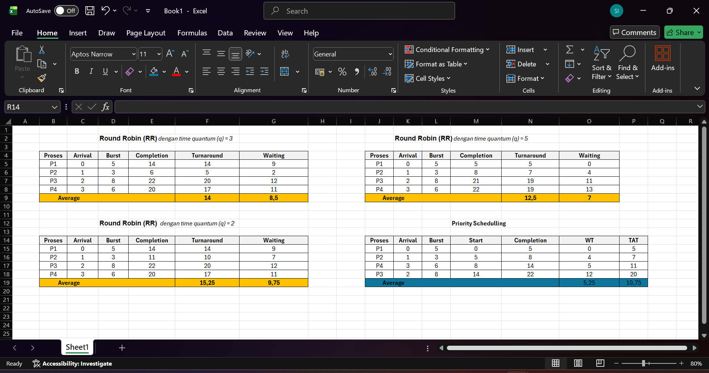

# Laporan Praktikum Minggu 6
Topik: Penjadwalan CPU – Round Robin (RR) dan Priority Scheduling

---

## Identitas
- **Nama**  : SASKIA ISTIQOMAH 
- **NIM**   : 250202967
- **Kelas** : 1IKRA

---

## Tujuan
Setelah menyelesaikan tugas ini, mahasiswa mampu:
1. Menghitung waiting time dan turnaround time pada algoritma RR dan Priority.
2. Menyusun tabel hasil perhitungan dengan benar dan sistematis.
3. Membandingkan performa algoritma RR dan Priority.
4. Menjelaskan pengaruh time quantum dan prioritas terhadap keadilan eksekusi proses.
5. Menarik kesimpulan mengenai efisiensi dan keadilan kedua algoritma.

---

## Dasar Teori

Penjadwalan CPU adalah mekanisme dalam sistem operasi yang bertugas menentukan urutan eksekusi proses yang berada dalam antrian siap (ready queue). Tujuannya adalah untuk memaksimalkan penggunaan CPU, meminimalkan waktu tunggu, serta meningkatkan efisiensi dan kinerja sistem secara keseluruhan. Salah satu algoritma penjadwalan yang paling umum digunakan adalah Round Robin (RR). Algoritma ini bersifat preemptive dan menggunakan time quantum atau jatah waktu yang sama untuk setiap proses. Proses akan dieksekusi secara bergiliran; jika waktu yang dialokasikan habis sebelum proses selesai, maka CPU akan menghentikan sementara proses tersebut dan memberikannya kembali giliran setelah semua proses lain mendapatkan jatahnya.

Round Robin memiliki karakteristik yang adil karena setiap proses memperoleh kesempatan eksekusi yang sama, sehingga cocok untuk sistem time-sharing atau sistem interaktif. Namun, ukuran quantum harus ditentukan dengan hati-hati. Quantum yang terlalu kecil dapat menyebabkan terlalu banyak context switching, sehingga meningkatkan overhead sistem, sedangkan quantum yang terlalu besar akan membuat algoritma ini berperilaku seperti First Come First Serve (FCFS).

Sementara itu, Priority Scheduling adalah algoritma penjadwalan yang memilih proses berdasarkan tingkat prioritas. Proses dengan prioritas tertinggi akan dieksekusi terlebih dahulu, baik dengan cara preemptive (menghentikan proses lain yang sedang berjalan) maupun non-preemptive (menunggu proses selesai terlebih dahulu). Algoritma ini efisien dalam menangani proses penting atau kritis, terutama dalam sistem real-time.

Namun, kelemahan utama Priority Scheduling adalah kemungkinan terjadinya starvation, yaitu kondisi di mana proses dengan prioritas rendah tidak pernah mendapat giliran eksekusi karena selalu kalah oleh proses dengan prioritas tinggi. Untuk mengatasinya, dapat digunakan teknik aging, yaitu menaikkan prioritas proses yang telah menunggu terlalu lama. Secara umum, Round Robin lebih menekankan pada keadilan waktu eksekusi, sedangkan Priority Scheduling berfokus pada pentingnya urutan eksekusi berdasarkan tingkat kepentingan proses.

---

## Langkah Praktikum
1. **Siapkan Data Proses**
   Gunakan contoh data berikut (boleh dimodifikasi sesuai kebutuhan):
   | Proses | Burst Time | Arrival Time | Priority |
   |:--:|:--:|:--:|:--:|
   | P1 | 5 | 0 | 2 |
   | P2 | 3 | 1 | 1 |
   | P3 | 8 | 2 | 4 |
   | P4 | 6 | 3 | 3 |

2. **Eksperimen 1 – Round Robin (RR)**
   - Gunakan *time quantum (q)* = 3.  
   - Hitung *waiting time* dan *turnaround time* untuk tiap proses.  
   - Simulasikan eksekusi menggunakan Gantt Chart (manual atau spreadsheet).  
     ```
     | P1 | P2 | P3 | P4 | P1 | P3 | ...
     0    3    6    9   12   15   18  ...
     ```
   - Catat sisa *burst time* tiap putaran.

3. **Eksperimen 2 – Priority Scheduling (Non-Preemptive)**
   - Urutkan proses berdasarkan nilai prioritas (angka kecil = prioritas tinggi).  
   - Lakukan perhitungan manual untuk:
     ```
     WT[i] = waktu mulai eksekusi - Arrival[i]
     TAT[i] = WT[i] + Burst[i]
     ```
   - Buat tabel perbandingan hasil RR dan Priority.

4. **Eksperimen 3 – Analisis Variasi Time Quantum (Opsional)**
   - Ubah *quantum* menjadi 2 dan 5.  
   - Amati perubahan nilai rata-rata *waiting time* dan *turnaround time*.  
   - Buat tabel perbandingan efek *quantum*.

5. **Eksperimen 4 – Dokumentasi**
   - Simpan semua hasil tabel dan screenshot ke:
     ```
     praktikum/week6-scheduling-rr-priority/screenshots/
     ```
   - Buat tabel perbandingan seperti berikut:

     | Algoritma | Avg Waiting Time | Avg Turnaround Time | Kelebihan | Kekurangan |
     |------------|------------------|----------------------|------------|-------------|
     | RR | ... | ... | Adil terhadap semua proses | Tidak efisien jika quantum tidak tepat |
     | Priority | ... | ... | Efisien untuk proses penting | Potensi *starvation* pada prioritas rendah |

6. **Commit & Push**
   ```bash
   git add .
   git commit -m "Minggu 6 - CPU Scheduling RR & Priority"
   git push origin main
   ```
---

## Kode / Perintah
Tuliskan potongan kode atau perintah utama:
```bash
uname -a
lsmod | head
dmesg | head
```

---

## Hasil Eksekusi
Sertakan screenshot hasil percobaan atau diagram:


## *EKSPERIMEN 1*

**Round Robin**(RR) _time quantum = 3_

| Proses | Arrival | Burst | Completion Time | Turnaround (CT - Arrival) | Waiting (TAT - Burst) |
| -----: | ------: | ----: | --------------: | ------------------------: | --------------------: |
|     P1 |       0 |     5 |              14 |                        14 |                     9 |
|     P2 |       1 |     3 |               6 |                         5 |                     2 |
|     P3 |       2 |     8 |              22 |                        20 |                    12 |
|     P4 |       3 |     6 |              20 |                        17 |                    11 |
|          Averange                           | 14                        |         8,5           |


**Simulasikan eksekusi menggunakan Gantt Chart**

```
| P1 | P2 | P3 | P4 | P1 | P3 | P4 | P3 |
0    3    6    9   12   14   17   20   22
```

**Sisa burst time tiap putaran.**

| No | Proses | Start | End | Exec (ms) |    Remaining sebelum   |    Remaining sesudah   |
| -: | :----: | ----: | --: | --------: | :--------------------: | :--------------------: |
|  1 |   P1   |     0 |   3 |         3 | P1:5, P2:3, P3:8, P4:6 | P1:2, P2:3, P3:8, P4:6 |
|  2 |   P2   |     3 |   6 |         3 | P1:2, P2:3, P3:8, P4:6 | P1:2, P2:0, P3:8, P4:6 |
|  3 |   P3   |     6 |   9 |         3 | P1:2, P2:0, P3:8, P4:6 | P1:2, P2:0, P3:5, P4:6 |
|  4 |   P4   |     9 |  12 |         3 | P1:2, P2:0, P3:5, P4:6 | P1:2, P2:0, P3:5, P4:3 |
|  5 |   P1   |    12 |  14 |         2 | P1:2, P2:0, P3:5, P4:3 | P1:0, P2:0, P3:5, P4:3 |
|  6 |   P3   |    14 |  17 |         3 | P1:0, P2:0, P3:5, P4:3 | P1:0, P2:0, P3:2, P4:3 |
|  7 |   P4   |    17 |  20 |         3 | P1:0, P2:0, P3:2, P4:3 | P1:0, P2:0, P3:2, P4:0 |
|  8 |   P3   |    20 |  22 |         2 | P1:0, P2:0, P3:2, P4:0 | P1:0, P2:0, P3:0, P4:0 |


## *Eksperimen 2*

**Priority Scheduling**

| Proses | Arrival | Burst | Start | Completion | WT = Start − Arrival | TAT = WT + Burst |
| -----: | ------: | ----: | ----: | ---------: | -------------------: | ---------------: |
|     P1 |       0 |     5 |     0 |          5 |                    0 |                5 |
|     P2 |       1 |     3 |     5 |          8 |                    4 |                7 |
|     P4 |       3 |     6 |     8 |         14 |                    5 |               11 |
|     P3 |       2 |     8 |    14 |         22 |                   12 |               20 |
|        |         |       |       | Average    | 5,24                 |         10,75    |

**Tabel Perbandingan RR dan Priority Scheduling**

| Proses | RR WT | RR TAT | RR Completion | Priority WT | Priority TAT | Priority Completion |
| -----: | ----: | -----: | ------------: | ----------: | -----------: | ------------------: |
|     P1 |     9 |     14 |            14 |           0 |            5 |                   5 |
|     P2 |     2 |      5 |             6 |           4 |            7 |                   8 |
|     P3 |    12 |     20 |            22 |          12 |           20 |                  22 |
|     P4 |    11 |     17 |            20 |           5 |           11 |                  14 |


## Eksperimen 3

**Analisis Variasi Time Quantum (Opsional)**

**Round Robin(RR)** _time quantum (q) = 2_

| Proses | Arrival | Burst | Completion | Turnaround (CT − Arrival) | Waiting (TAT − Burst) |
| -----: | ------: | ----: | ---------: | ------------------------: | --------------------: |
|     P1 |       0 |     5 |         14 |                        14 |                     9 |
|     P2 |       1 |     3 |         11 |                        10 |                     7 |
|     P3 |       2 |     8 |         22 |                        20 |                    12 |
|     P4 |       3 |     6 |         20 |                        17 |                    11 |
|               Averange                | 15,25                     |         9,75          |


**Round Robin(RR)** _time quantum (q) = 5_

| Proses | Arrival | Burst | Completion | Turnaround (CT − Arrival) | Waiting (TAT − Burst)|
| -----: | ------: | ----: | ---------: | ---------:                | ------:              |
|     P1 |       0 |     5 |          5 |          5                |       0              |
|     P2 |       1 |     3 |          8 |          7                |       4              |
|     P3 |       2 |     8 |         21 |         19                |      11              |
|     P4 |       3 |     6 |         22 |         19                |      13              |
|                 Averange              | 15,25                     |         9,75         |


---

## Analisis
- Jelaskan makna hasil percobaan.  
- Hubungkan hasil dengan teori (fungsi kernel, system call, arsitektur OS).  
- Apa perbedaan hasil di lingkungan OS berbeda (Linux vs Windows)?  

---

## Kesimpulan
Tuliskan 2–3 poin kesimpulan dari praktikum ini.

---
## Tugas

1. Hitung waiting time dan turnaround time untuk algoritma RR dan Priority.
2. Sajikan hasil perhitungan dan Gantt Chart dalam laporan.md.
3. Bandingkan performa dan jelaskan pengaruh time quantum serta prioritas.


---
## Quiz
1. Apa perbedaan utama antara Round Robin dan Priority Scheduling? 
   **Jawaban:**

  Perbedaan utama antara Round Robin (RR) dan Priority Scheduling terletak pada dasar pemilihan proses yang akan dieksekusi oleh CPU. Round Robin memilih proses secara bergiliran berdasarkan urutan kedatangan dan memberikan setiap proses jatah waktu eksekusi (time quantum) yang sama, sehingga lebih menekankan pada keadilan dan cocok untuk sistem time-sharing atau interaktif. 
  Sebaliknya, Priority Scheduling memilih proses berdasarkan tingkat prioritas, di mana proses dengan prioritas tertinggi akan dijalankan terlebih dahulu, baik secara preemptive maupun non-preemptive. Algoritma ini lebih efisien untuk menangani proses penting, namun dapat menyebabkan proses dengan prioritas rendah mengalami kelaparan (starvation) jika tidak diatasi dengan teknik seperti aging.

2. Apa pengaruh besar/kecilnya time quantum terhadap performa sistem?
   **Jawaban:**

   Besar atau kecilnya time quantum dalam algoritma Round Robin memiliki pengaruh yang sangat penting terhadap performa sistem. Jika time quantum terlalu kecil, maka CPU akan sering melakukan context switching (perpindahan antar proses), yang menyebabkan overhead tinggi karena waktu CPU lebih banyak digunakan untuk pergantian proses daripada eksekusi sebenarnya. Hal ini membuat sistem menjadi tidak efisien, meskipun respons terhadap proses interaktif menjadi cepat. Sebaliknya, jika time quantum terlalu besar, maka setiap proses dapat berjalan terlalu lama sebelum berganti, sehingga sistem akan berperilaku mirip dengan First Come First Serve (FCFS). Akibatnya, waktu respons untuk proses lain menjadi lebih lambat dan sistem kehilangan keadilan antar proses. Oleh karena itu, pemilihan ukuran time quantum harus seimbang cukup besar untuk mengurangi overhead, namun cukup kecil agar sistem tetap responsif.

3. Mengapa algoritma Priority dapat menyebabkan starvation?
   **Jawaban:**

   karena proses dengan prioritas rendah bisa terus-menerus tertunda eksekusinya apabila selalu ada proses baru dengan prioritas lebih tinggi yang datang ke sistem. Dalam kondisi seperti ini, proses berprioritas rendah bisa menunggu sangat lama bahkan tidak pernah dijalankan sama sekali. Dengan kata lain, starvation terjadi karena tidak adanya mekanisme pembatas waktu atau penyeimbang antara proses prioritas tinggi dan rendah. Untuk mengatasinya, sistem dapat menerapkan aging, yaitu menaikkan prioritas proses yang sudah lama menunggu agar tetap mendapat kesempatan dieksekusi dan mencegah kelaparan proses di antrian.

---

## Refleksi Diri
Tuliskan secara singkat:
- Apa bagian yang paling menantang minggu ini?  
- Bagaimana cara Anda mengatasinya?  

---

**Credit:**  
_Template laporan praktikum Sistem Operasi (SO-202501) – Universitas Putra Bangsa_
