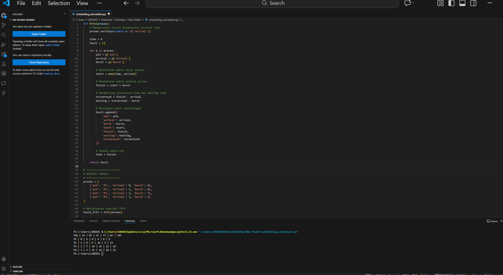

# Laporan Praktikum Minggu [X]
Topik: Simulasi Algoritma Penjadwalan CPU

---

## Identitas
- **Nama**  : SASKIA ISTIQOMAH
- **NIM**   : 250202967 
- **Kelas** : 1 IKRA

---

## Tujuan
Setelah menyelesaikan tugas ini, mahasiswa mampu:
1. Membuat program simulasi algoritma penjadwalan FCFS dan/atau SJF.  
2. Menjalankan program dengan dataset uji yang diberikan atau dibuat sendiri.  
3. Menyajikan output simulasi dalam bentuk tabel atau grafik.  
4. Menjelaskan hasil simulasi secara tertulis.  
5. Mengunggah kode dan laporan ke Git repository dengan rapi dan tepat waktu.

---

## Dasar Teori

1. Sistem Operasi dan Manajemen Proses
   Sistem operasi berfungsi mengelola sumber daya komputer, salah satunya adalah manajemen proses. Manajemen proses bertugas mengatur eksekusi beberapa proses agar dapat berjalan secara efisien dengan memanfaatkan CPU secara optimal.

2. Konsep Penjadwalan CPU
   Penjadwalan CPU adalah mekanisme penentuan urutan proses yang akan dieksekusi oleh CPU. Karena CPU hanya dapat memproses satu proses pada satu waktu, penjadwalan diperlukan untuk mengatur giliran eksekusi proses.

3. Algoritma Penjadwalan CPU
   Algoritma penjadwalan CPU merupakan aturan yang digunakan untuk memilih proses yang akan dijalankan, seperti First Come First Served (FCFS), Shortest Job First (SJF), Priority Scheduling, dan Round Robin (RR). Setiap algoritma memiliki karakteristik serta kelebihan dan kekurangan masing-masing.

4. Parameter Kinerja Penjadwalan
   Kinerja algoritma penjadwalan dievaluasi menggunakan parameter seperti waiting time, turnaround time, response time, dan CPU utilization. Parameter ini digunakan untuk menilai efisiensi dan keadilan suatu algoritma penjadwalan.

5.  Simulasi Algoritma Penjadwalan CPU
   Simulasi algoritma penjadwalan CPU digunakan untuk memodelkan dan menganalisis cara kerja algoritma dalam kondisi tertentu. Melalui simulasi, performa berbagai algoritma dapat dibandingkan dan dipahami tanpa harus diterapkan langsung pada sistem operasi nyata.


---

## Langkah Praktikum
1. **Menyiapkan Dataset**

   Buat dataset proses minimal berisi:

   | Proses | Arrival Time | Burst Time |
   |:--:|:--:|:--:|
   | P1 | 0 | 6 |
   | P2 | 1 | 8 |
   | P3 | 2 | 7 |
   | P4 | 3 | 3 |

2. **Implementasi Algoritma**

   Program harus:
   - Menghitung *waiting time* dan *turnaround time*.  
   - Mendukung minimal **1 algoritma (FCFS atau SJF non-preemptive)**.  
   - Menampilkan hasil dalam tabel.

3. **Eksekusi & Validasi**

   - Jalankan program menggunakan dataset uji.  
   - Pastikan hasil sesuai dengan perhitungan manual minggu sebelumnya.  
   - Simpan hasil eksekusi (screenshot).

4. **Analisis**

   - Jelaskan alur program.  
   - Bandingkan hasil simulasi dengan perhitungan manual.  
   - Jelaskan kelebihan dan keterbatasan simulasi.

5. **Commit & Push**

   ```bash
   git add .
   git commit -m "Minggu 9 - Simulasi Scheduling CPU"
   git push origin main
   ```
---

## Kode / Perintah
Tuliskan potongan kode atau perintah utama:
```bash
def fcfs(proses):
    # Mengurutkan proses berdasarkan arrival time
    proses.sort(key=lambda x: x['arrival'])

    time = 0
    hasil = []

    for p in proses:
        pid = p['pid']
        arrival = p['arrival']
        burst = p['burst']

        # Menentukan waktu mulai proses
        start = max(time, arrival)

        # Menentukan waktu selesai proses
        finish = start + burst

        # Menghitung turnaround time dan waiting time
        turnaround = finish - arrival
        waiting = turnaround - burst

        # Menyimpan hasil perhitungan
        hasil.append({
            'pid': pid,
            'arrival': arrival,
            'burst': burst,
            'start': start,
            'finish': finish,
            'waiting': waiting,
            'turnaround': turnaround
        })

        # Update waktu CPU
        time = finish

    return hasil


# =====================
# DATASET PROSES
# =====================
proses = [
    {'pid': 'P1', 'arrival': 0, 'burst': 6},
    {'pid': 'P2', 'arrival': 1, 'burst': 8},
    {'pid': 'P3', 'arrival': 2, 'burst': 7},
    {'pid': 'P4', 'arrival': 3, 'burst': 3}
]

# Menjalankan simulasi FCFS
hasil_fcfs = fcfs(proses)

# Menampilkan hasil
print("PID | AT | BT | ST | FT | WT | TAT")
for h in hasil_fcfs:
    print(
        h['pid'], "|",
        h['arrival'], "|",
        h['burst'], "|",
        h['start'], "|",
        h['finish'], "|",
        h['waiting'], "|",
        h['turnaround']
    )

```
---

## Hasil Eksekusi
Sertakan screenshot hasil percobaan atau diagram:


---

## Tugas dan Analisis

FCFS Model Program Python
| Proses | Arrival | Burst | Start | Finish Time | Waiting Time | Turnaround Time |
| ------ | ------- | ----- | ----- | ---------- | ------------ | --------------- |
| P1     | 0       | 6     | 0     | 6          | 0            | 6               |
| P2     | 1       | 8     | 6     | 14         | 5            | 13              |
| P3     | 2       | 7     | 14    | 21         | 12           | 19              |
| P4     | 3       | 3     | 21    | 24         | 18           | 21              |

---

**1. Penjelasan alur program**

**FCFS (First Come First Serve) :**

* Fungsi fcfs : (proses) menerima data proses dalam bentuk daftar (list) yang berisi PID, arrival time, dan burst time.
* Data proses diurutkan berdasarkan arrival time agar dieksekusi sesuai urutan kedatangan.
* Variabel time digunakan untuk menyimpan waktu CPU saat ini.
* Program kemudian memproses setiap proses satu per satu:
  * Start time : ditentukan dari waktu CPU saat ini atau waktu kedatangan proses (dipilih yang paling besar).
  * Finish time : dihitung dengan menambahkan burst time ke start time.
  * Turnaround time : dihitung dari selisih antara finish time dan arrival time.
  * Waiting time : dihitung dari turnaround time dikurangi burst time.
* Setelah satu proses selesai, nilai time diperbarui menjadi finish time.
* Semua hasil perhitungan disimpan dalam bentuk list.
* Program menampilkan hasil akhir dalam bentuk tabel yang berisi PID, Arrival, Burst, Start, Finish, Waiting, dan Turnaround.

 **2. Perbandingan hasil simulasi dengan perhitungan manual** 

  FCFS Model Program 

  | Proses | Arrival Time | Burst Time | Start Time | Finish Time | Waiting Time | Turnaround Time |
| ------ | ------------ | ---------- | ---------- | ----------- | ------------ | --------------- |
| P1     | 0            | 6          | 0          | 6           | 0            | 6               |
| P2     | 1            | 8          | 6          | 14          | 5            | 13              |
| P3     | 2            | 7          | 14         | 21          | 12           | 19              |
| P4     | 3            | 3          | 21         | 24          | 18           | 21              |

 FCFS Model Manual Week-5


| Aspek Perbandingan | Perhitungan Manual | Simulasi Program  |
| ------------------ | ------------------ | ----------------- |
| Urutan Proses      | P1 → P2 → P3 → P4  | P1 → P2 → P3 → P4 |
| Start Time         | Sesuai Gantt Chart | Sama              |
| Finish Time        | Sesuai Gantt Chart | Sama              |
| Waiting Time       | Dihitung manual    | Sama              |
| Turnaround Time    | Dihitung manual    | Sama              |
| Selisih Hasil      | –                  | Tidak ada         |

**3. Penjelasan kelebihan dan keterbatasan simulasi**

**Kelebihan Simulasi FCFS**

* Mudah dipahami karena proses dijalankan sesuai urutan kedatangan.
* Algoritma sederhana dan mudah diimplementasikan dalam program.
* Memudahkan pemahaman konsep **waiting time** dan **turnaround time**.
* Hasil simulasi dapat digunakan untuk memvalidasi perhitungan manual.
* Cocok digunakan sebagai simulasi awal dalam pembelajaran penjadwalan CPU.

**Keterbatasan Simulasi FCFS**

* Tidak mempertimbangkan burst time dalam menentukan urutan proses.
* Proses dengan burst time kecil dapat mengalami waktu tunggu yang lama.
* Bersifat non-preemptive sehingga kurang mencerminkan sistem operasi modern.
* Tidak mendukung prioritas proses.
* Simulasi masih bersifat statis karena menggunakan dataset tetap.


---

## Kesimpulan

* Algoritma First Come First Serve (FCFS) mengeksekusi proses berdasarkan urutan waktu kedatangan.
* Hasil simulasi program FCFS sesuai dengan perhitungan manual, tanpa perbedaan nilai.
* Nilai start time, finish time, waiting time, dan turnaround time berhasil dihitung dengan benar.
* Simulasi membantu memahami konsep dasar penjadwalan CPU dan validasi perhitungan manual.
* Algoritma FCFS mudah diimplementasikan namun memiliki keterbatasan.
* FCFS tidak mempertimbangkan burst time dan bersifat non-preemptive.
* Proses dengan burst time kecil dapat mengalami waktu tunggu yang lama.
* FCFS lebih cocok digunakan untuk pembelajaran dasar dibandingkan sistem operasi modern.

--- 


## Quiz
1. Mengapa simulasi diperlukan untuk menguji algoritma scheduling?
   **Jawaban:**
   Simulasi diperlukan untuk menguji algoritma scheduling karena memungkinkan pengujian dilakukan tanpa risiko mengganggu sistem operasi nyata. Melalui simulasi, berbagai algoritma dapat diuji dan dibandingkan secara objektif menggunakan kondisi yang sama, sehingga analisis kinerjanya lebih akurat. Selain itu, simulasi menghemat waktu dan biaya karena tidak memerlukan perubahan pada perangkat keras maupun sistem operasi. Simulasi juga memungkinkan pengujian berbagai skenario, termasuk kondisi beban sistem yang tinggi, serta membantu pemahaman konsep penjadwalan melalui visualisasi alur eksekusi proses.

2. Apa perbedaan hasil simulasi dengan perhitungan manual jika dataset besar?  
   **Jawaban:**
    Pada dataset yang besar, perbedaan antara hasil simulasi dan perhitungan manual lebih terlihat pada proses pengerjaannya. Perhitungan manual menjadi sulit, memakan waktu lama, dan sangat rentan terhadap kesalahan karena banyaknya data yang harus dihitung satu per satu. Sebaliknya, simulasi dapat mengolah data dalam jumlah besar dengan cepat dan konsisten, sehingga hasilnya lebih akurat dan dapat diandalkan. Selain itu, simulasi mampu menangani kondisi yang kompleks yang sulit dilakukan secara manual. Oleh karena itu, meskipun secara teori hasilnya sama, simulasi jauh lebih efektif dan praktis dibandingkan perhitungan manual pada dataset besar.

3. Algoritma mana yang lebih mudah diimplementasikan? Jelaskan. 
   **Jawaban:**  
    Algoritma yang paling mudah diimplementasikan adalah First Come First Served (FCFS). Hal ini karena FCFS menggunakan prinsip sederhana, yaitu proses dieksekusi sesuai urutan kedatangannya tanpa adanya prioritas atau pembagian waktu khusus. Implementasinya hanya memerlukan satu antrean (queue) dan tidak membutuhkan perhitungan tambahan seperti estimasi burst time, prioritas, atau time quantum. Selain itu, FCFS bersifat non-preemptive, sehingga tidak perlu mekanisme interupsi proses yang sedang berjalan. Karena kesederhanaan inilah, FCFS sering digunakan sebagai algoritma dasar dalam pembelajaran penjadwalan CPU.

---

## Refleksi Diri
Tuliskan secara singkat:
- Apa bagian yang paling menantang minggu ini?  
- Bagaimana cara Anda mengatasinya?  

---

**Credit:**  
_Template laporan praktikum Sistem Operasi (SO-202501) – Universitas Putra Bangsa_
